# Basics
- [Object-Oriented Basics](./theory/basics.md)

# Object-Oriented Design Case Studies

1. [Design a Library Management System](./src/main/java/dev/bishnoi/library_management_system/README.md)
2. [Design a Parking Lot](./src/main/java/dev/bishnoi/parking_lot/README.md)
3. Design Amazon - Online Shopping System
4. Design Stack Overflow
5. Design a Movie Ticket Booking System
6. Design an ATM
7. Design an Airline Management System
8. Design Blackjack and a Deck of Cards
9. Design a Hotel Management System
10. Design a Restaurant Management system
11. Design Chess
12. Design an Online Stock Brokerage System
13. Design a Car Rental System
14. Design LinkedIn
15. Design Cricinfo
16. Design Facebook - a Social Network

# Design Amazon - Online Shopping System

Let's design an online retail store.

Amazon ([amazon.com](http://amazon.com)) is the world’s largest online retailer. The company was originally a bookseller
but has expanded to sell a wide variety of consumer goods and digital media. For the sake of this problem, we will focus
on their online retail business where users can sell/buy their products.

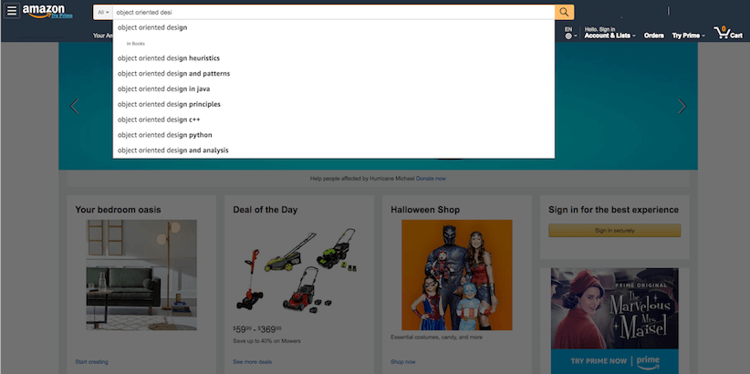

### Requirements and Goals of the System [#](#div-stylecolorblack-background-colore2f4c7-border-radius5px-padding5pxrequirements-and-goals-of-the-system)

We will be designing a system with the following requirements:

01. Users should be able to add new products to sell.
02. Users should be able to search for products by their name or category.
03. Users can search and view all the products, but they will have to become a registered member to buy a product.
04. Users should be able to add/remove/modify product items in their shopping cart.
05. Users can check out and buy items in the shopping cart.
06. Users can rate and add a review for a product.
07. The user should be able to specify a shipping address where their order will be delivered.
08. Users can cancel an order if it has not shipped.
09. Users should get notifications whenever there is a change in the order or shipping status.
10. Users should be able to pay through credit cards or electronic bank transfer.
11. Users should be able to track their shipment to see the current state of their order.

### Use case Diagram [#](#div-stylecolorblack-background-colore2f4c7-border-radius5px-padding5pxuse-case-diagram)

We have four main Actors in our system:

- **Admin:** Mainly responsible for account management and adding or modifying new product categories.
- **Guest:** All guests can search the catalog, add/remove items to the shopping cart, as well as become registered
  members.
- **Member:** Members can perform all the activities that guests can, in addition to which, they can place orders and
  add new products to sell.
- **System:** Mainly responsible for sending notifications for orders and shipping updates.

Here are the top use cases of the Online Shopping System:

1. Add/update products; whenever a product is added or modified, we will update the catalog.
2. Search for products by their name or category.
3. Add/remove product items in the shopping cart.
4. Check-out to buy product items in the shopping cart.
5. Make a payment to place an order.
6. Add a new product category.
7. Send notifications to members with shipment updates.

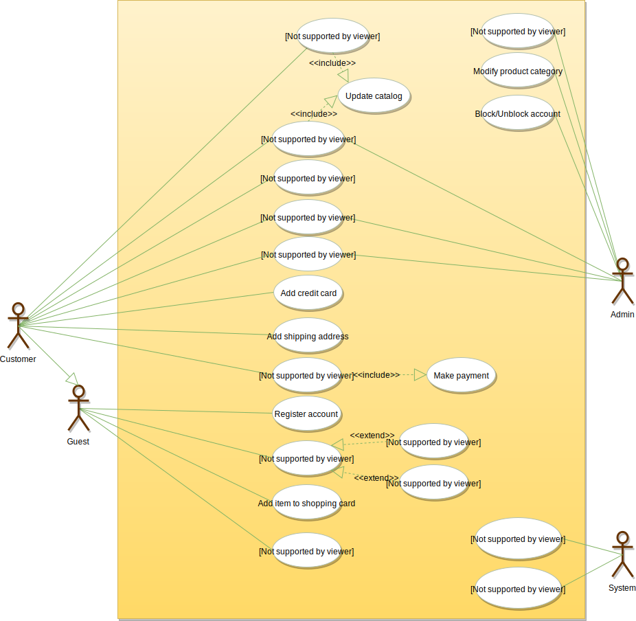

### Class diagram [#](#div-stylecolorblack-background-colore2f4c7-border-radius5px-padding5pxclass-diagramdiv)

Here are the descriptions of the different classes of our Online Shopping System:

- **Account:** There are two types of registered accounts in the system: one will be an Admin, who is responsible for
  adding new product categories and blocking/unblocking members; the other, a Member, who can buy/sell products.
- **Guest:** Guests can search for and view products, and add them in the shopping cart. To place an order they have to
  become a registered member.
- **Catalog:** Users of our system can search for products by their name or category. This class will keep an index of
  all products for faster search.
- **ProductCategory:** This will encapsulate the different categories of products, such as books, electronics, etc.
- **Product:** This class will encapsulate the entity that the users of our system will be buying and selling. Each
  Product will belong to a ProductCategory.
- **ProductReview:** Any registered member can add a review about a product.
- **ShoppingCart:** Users will add product items that they intend to buy to the shopping cart.
- **Item:** This class will encapsulate a product item that the users will be buying or placing in the shopping cart.
  For example, a pen could be a product and if there are 10 pens in the inventory, each of these 10 pens will be
  considered a product item.
- **Order:** This will encapsulate a buying order to buy everything in the shopping cart.
- **OrderLog:** Will keep a track of the status of orders, such as unshipped, pending, complete, canceled, etc.
- **ShipmentLog:** Will keep a track of the status of shipments, such as pending, shipped, delivered, etc.
- **Notification:** This class will take care of sending notifications to customers.
- **Payment:** This class will encapsulate the payment for an order. Members can pay through credit card or electronic
  bank transfer.


Class diagram for Online Shopping System

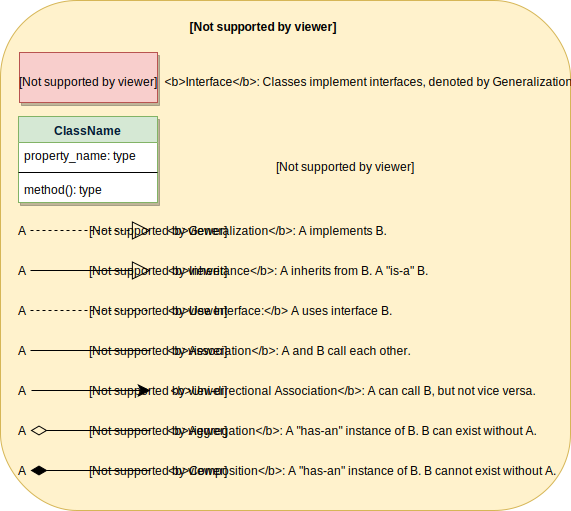

### Activity Diagram [#](#div-stylecolorblack-background-colore2f4c7-border-radius5px-padding5pxactivity-diagram)

Following is the activity diagram for a user performing online shopping:

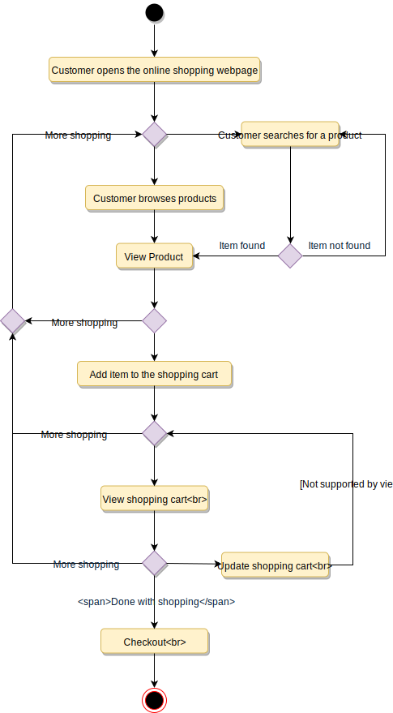

### Sequence Diagram [#](#div-stylecolorblack-background-colore2f4c7-border-radius5px-padding5px-sequence-diagramdiv)

1. Here is the sequence diagram for searching from the catalog:

<!--THE END-->

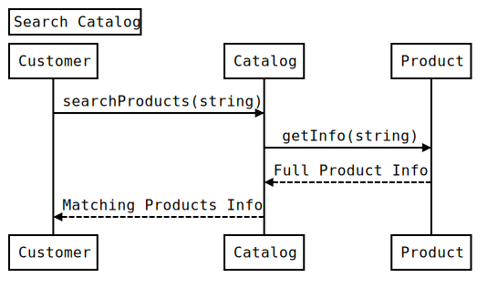

2. Here is the sequence diagram for adding an item to the shopping cart:

<!--THE END-->


3. Here is the sequence diagram for checking out to place an order:

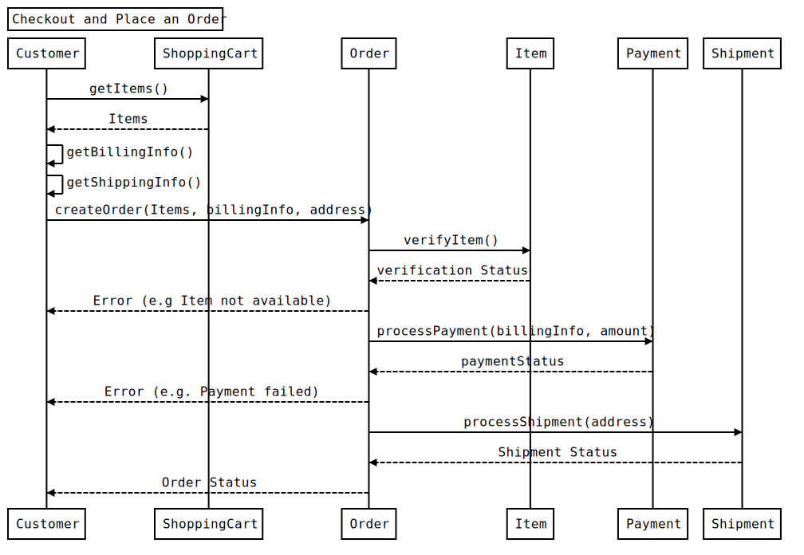

### Code [#](#div-stylecolorblack-background-colore2f4c7-border-radius5px-padding5pxcodediv)

Here is the high-level definition for the classes described above.

**Enums, data types, and constants:** Here are the required enums, data types, and constants:

```java
public class Address {
    private String streetAddress;
    private String city;
    private String state;
    private String zipCode;
    private String country;
}

public enum OrderStatus {
    UNSHIPPED, PENDING, SHIPPED, COMPLETED, CANCELED, REFUND_APPLIED
}

public enum AccountStatus {
    ACTIVE, BLOCKED, BANNED, COMPROMISED, ARCHIVED, UNKNOWN
}

public enum ShipmentStatus {
    PENDING, SHIPPED, DELIVERED, ON_HOLD,
}

public enum PaymentStatus {
    UNPAID, PENDING, COMPLETED, FILLED, DECLINED, CANCELLED, ABANDONED, SETTLING, SETTLED, REFUNDED
}
```

**Account, Customer, Admin, and Guest:** These classes represent different people that interact with our system:

```java
// For simplicity, we are not defining getter and setter functions. The reader can
// assume that all class attributes are private and accessed through their respective
// public getter methods and modified only through their public methods function.

public class Account {
    private String userName;
    private String password;
    private AccountStatus status;
    private String name;
    private Address shippingAddress;
    private String email;
    private String phone;

    private List<CreditCard> creditCards;
    private List<ElectronicBankTransfer> bankAccounts;

    public boolean addProduct(Product product);

    public boolean addProductReview(ProductReview review);

    public boolean resetPassword();
}

public abstract class Customer {
    private ShoppingCart cart;
    private Order order;

    public ShoppingCart getShoppingCart();

    public bool addItemToCart(Item item);

    public bool removeItemFromCart(Item item);
}

public class Guest extends Customer {
    public bool registerAccount();
}

public class Member extends Customer {
    private Account account;

    public OrderStatus placeOrder(Order order);
}
```

**ProductCategory, Product, and ProductReview:** Here are the classes related to a product:

```java
public class ProductCategory {
    private String name;
    private String description;
}

public class ProductReview {
    private int rating;
    private String review;

    private Member reviewer;
}

public class Product {
    private String productID;
    private String name;
    private String description;
    private double price;
    private ProductCategory category;
    private int availableItemCount;

    private Account seller;

    public int getAvailableCount();

    public boolean updatePrice(double newPrice);
}
```

**ShoppingCart, Item, Order, and OrderLog:** Users will add items to the shopping cart and place an order to buy all the
items in the cart.

```java
public class Item {
    private String productID;
    private int quantity;
    private double price;

    public boolean updateQuantity(int quantity);
}

public class ShoppingCart {
    private List<Items> items;

    public boolean addItem(Item item);

    public boolean removeItem(Item item);

    public boolean updateItemQuantity(Item item, int quantity);

    public List<Item> getItems();

    public boolean checkout();
}

public class OrderLog {
    private String orderNumber;
    private Date creationDate;
    private OrderStatus status;
}

public class Order {
    private String orderNumber;
    private OrderStatus status;
    private Date orderDate;
    private List<OrderLog> orderLog;

    public boolean sendForShipment();

    public boolean makePayment(Payment payment);

    public boolean addOrderLog(OrderLog orderLog);
}
```

**Shipment, ShipmentLog, and Notification:** After successfully placing an order, a shipment record will be created:

```java
public class ShipmentLog {
    private String shipmentNumber;
    private ShipmentStatus status;
    private Date creationDate;
}

public class Shipment {
    private String shipmentNumber;
    private Date shipmentDate;
    private Date estimatedArrival;
    private String shipmentMethod;
    private List<ShipmentLog> shipmentLogs;

    public boolean addShipmentLog(ShipmentLog shipmentLog);
}

public abstract class Notification {
    private int notificationId;
    private Date createdOn;
    private String content;

    public boolean sendNotification(Account account);
}
```

**Search interface and Catalog:** Catalog will implement Search to facilitate searching of products.

```java
public interface Search {
    public List<Product> searchProductsByName(String name);

    public List<Product> searchProductsByCategory(String category);
}

public class Catalog implements Search {
    HashMap<String, List<Product>> productNames;
    HashMap<String, List<Product>> productCategories;

    public List<Product> searchProductsByName(String name) {
        return productNames.get(name);
    }

    public List<Product> searchProductsByCategory(String category) {
        return productCategories.get(category);
    }
}
```

# Design Stack Overflow

Stack Overflow is one of the largest online communities for developers to learn and share their knowledge. The website
provides a platform for its users to ask and answer questions, and through membership and active participation, to vote
questions and answers up or down. Users can edit questions and answers in a fashion similar to
a [wiki](https://en.wikipedia.org/wiki/Wiki).

Users of Stack Overflow can earn reputation points and badges. For example, a person is awarded ten reputation points
for receiving an “up” vote on an answer and five points for the “up” vote of a question. The can also receive badges for
their valued contributions. A higher reputation lets users unlock new privileges like the ability to vote, comment on,
and even edit other people’s posts.


### Requirements and Goals of the System

We will be designing a system with the following requirements:

01. Any non-member (guest) can search and view questions. However, to add or upvote a question, they have to become a
    member.
02. Members should be able to post new questions.
03. Members should be able to add an answer to an open question.
04. Members can add comments to any question or answer.
05. A member can upvote a question, answer or comment.
06. Members can flag a question, answer or comment, for serious problems or moderator attention.
07. Any member can add a [bounty](https://stackoverflow.com/help/bounty) to their question to draw attention.
08. Members will earn [badges](https://stackoverflow.com/help/badges) for being helpful.
09. Members can vote to [close](https://stackoverflow.com/help/closed-questions) a question; Moderators can close or
    reopen any question.
10. Members can add [tags](https://stackoverflow.com/help/tagging) to their questions. A tag is a word or phrase that
    describes the topic of the question.
11. Members can vote to [delete](https://stackoverflow.com/help/deleted-questions) extremely off-topic or very
    low-quality questions.
12. Moderators can close a question or undelete an already deleted question.
13. The system should also be able to identify most frequently used tags in the questions.

### Use-case Diagram

We have five main actors in our system:

- **Admin:** Mainly responsible for blocking or unblocking members.
- **Guest:** All guests can search and view questions.
- **Member:** Members can perform all activities that guests can, in addition to which they can add/remove questions,
  answers, and comments. Members can delete and un-delete their questions, answers or comments.
- **Moderator:** In addition to all the activities that members can perform, moderators can close/delete/undelete any
  question.
- **System:** Mainly responsible for sending notifications and assigning badges to members.

Here are the top use cases for Stack Overflow:

1. Search questions.
2. Create a new question with bounty and tags.
3. Add/modify answers to questions.
4. Add comments to questions or answers.
5. Moderators can close, delete, and un-delete any question.

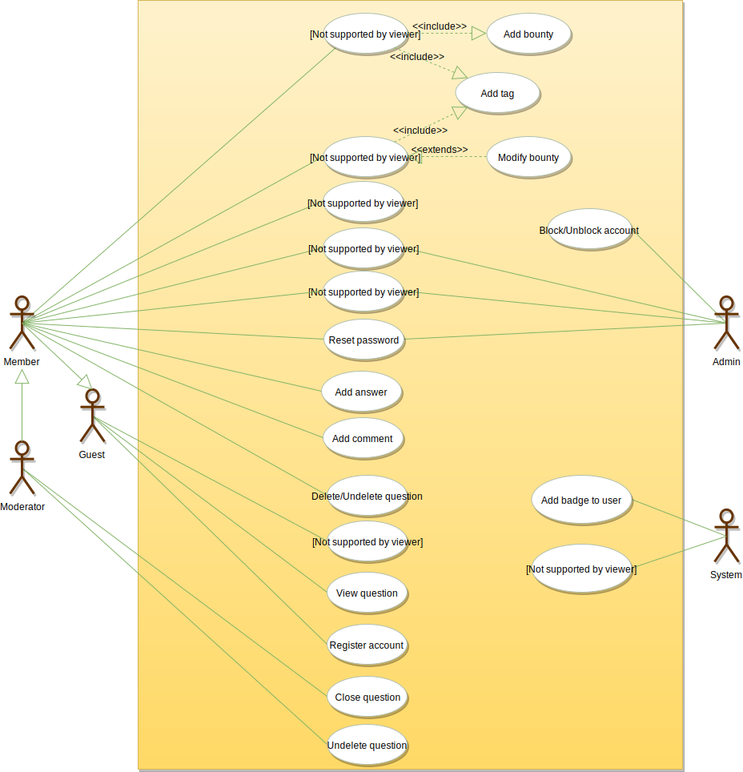

Use case diagram

### Class diagram

Here are the main classes of Stack Overflow System:

- **Question:** This class is the central part of our system. It has attributes like Title and Description to define the
  question. In addition to this, we will track the number of times a question has been viewed or voted on. We should
  also track the status of a question, as well as closing remarks if the question is closed.
- **Answer:** The most important attributes of any answer will be the text and the view count. In addition to that, we
  will also track the number of times an answer is voted on or flagged. We should also track if the question owner has
  accepted an answer.
- **Comment:** Similar to answer, comments will have text, and view, vote, and flag counts. Members can add comments to
  questions and answers.
- **Tag:** Tags will be identified by their names and will have a field for a description to define them. We will also
  track daily and weekly frequencies at which tags are associated with questions.
- **Badge:** Similar to tags, badges will have a name and description.
- **Photo:** Questions or answers can have photos.
- **Bounty:** Each member, while asking a question, can place a bounty to draw attention. Bounties will have a total
  reputation and an expiry date.
- **Account:** We will have four types of accounts in the system, guest, member, admin, and moderator. Guests can search
  and view questions. Members can ask questions and earn reputation by answering questions and from bounties.
- **Notification:** This class will be responsible for sending notifications to members and assigning badges to members
  based on their reputations.


Class diagram


### Activity diagrams

**Post a new question:** Any member or moderator can perform this activity. Here are the steps to post a question:


### Sequence Diagram

Following is the sequence diagram for creating a new question:

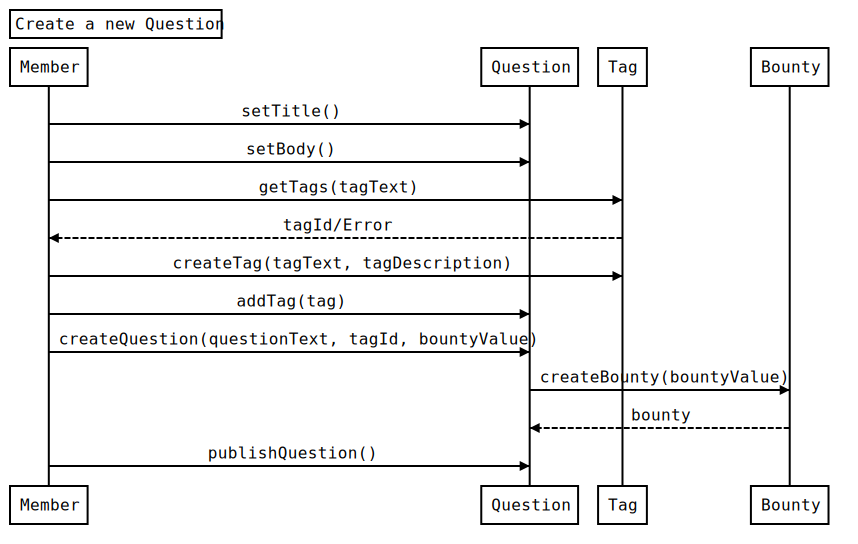

### Code

Here is the high-level definition for the classes described above.

**Enums, data types, and constants:** Here are the required enums, data types, and constants:

```java
public enum QuestionStatus {
    OPEN,
    CLOSED,
    ON_HOLD,
    DELETED
}

public enum QuestionClosingRemark {
    DUPLICATE,
    OFF_TOPIC,
    TOO_BROAD,
    NOT_CONSTRUCTIVE,
    NOT_A_REAL_QUESTION,
    PRIMARILY_OPINION_BASED
}

public enum AccountStatus {
    ACTIVE,
    CLOSED,
    CANCELED,
    BLACKLISTED,
    BLOCKED
}
```

**Account, Member, Admin, and Moderator:** These classes represent the different people that interact with our system:

```java
// For simplicity, we are not defining getter and setter functions. The reader can
// assume that all class attributes are private and accessed through their respective
// public getter methods and modified only through their public methods function.

public class Account {
    private String id;
    private String password;
    private AccountStatus status;
    private String name;
    private Address address;
    private String email;
    private String phone;
    private int reputation;

    public boolean resetPassword();
}

public class Member {
    private Account account;
    private List<Badge> badges;

    public int getReputation();

    public String getEmail();

    public boolean createQuestion(Question question);

    public boolean createTag(Tag tag);
}

public class Admin extends Member {
    public boolean blockMember(Member member);

    public boolean unblockMember(Member member);
}

public class Moderator extends Member {
    public boolean closeQuestion(Question question);

    public boolean undeleteQuestion(Question question);
}
```

**Badge, Tag, and Notification:** Members have badges, questions have tags and notifications:

```java
public class Badge {
    private String name;
    private String description;
}

public class Tag {
    private String name;
    private String description;
    private long dailyAskedFrequency;
    private long weeklyAskedFrequency;
}

public class Notification {
    private int notificationId;
    private Date createdOn;
    private String content;

    public boolean sendNotification();
}
```

**Photo and Bounty:** Members can put bounties on questions. Answers and Questions can have multiple photos:

```java
public class Photo {
    private int photoId;
    private String photoPath;
    private Date creationDate;

    private Member creatingMember;

    public boolean delete();
}

public class Bounty {
    private int reputation;
    private Date expiry;

    public boolean modifyReputation(int reputation);
}
```

**Question, Comment and Answer:** Members can ask questions, as well as add an answer to any question. All members can
add comments to all open questions or answers:

```java
public interface Search {
    public static List<Question> search(String query);
}

public class Question implements Search {
    private String title;
    private String description;
    private int viewCount;
    private int voteCount;
    private Date creationTime;
    private Date updateTime;
    private QuestionStatus status;
    private QuestionClosingRemark closingRemark;

    private Member askingMember;
    private Bounty bounty;
    private List<Photo> photos;
    private List<Comment> comments;
    private List<Answer> answers;

    public boolean close();

    public boolean undelete();

    public boolean addComment(Comment comment);

    public boolean addBounty(Bounty bounty);

    public static List<Question> search(String query) {
// return all questions containing the string query in their title or description.
    }
}

public class Comment {
    private String text;
    private Date creationTime;
    private int flagCount;
    private int voteCount;

    private Member askingMember;

    public boolean incrementVoteCount();
}

public class Answer {
    private String answerText;
    private boolean accepted;
    private int voteCount;
    private int flagCount;
    private Date creationTime;

    private Member creatingMember;
    private List<Photo> photos;

    public boolean incrementVoteCount();
}
```

# Design a Movie Ticket Booking System

An online movie ticket booking system facilitates the purchasing of movie tickets to its customers. E-ticketing systems
allow customers to browse through movies currently playing and book seats, anywhere and anytime.


### Requirements and Goals of the System

Our ticket booking service should meet the following requirements:

01. It should be able to list the cities where affiliate cinemas are located.
02. Each cinema can have multiple halls and each hall can run one movie show at a time.
03. Each Movie will have multiple shows.
04. Customers should be able to search movies by their title, language, genre, release date, and city name.
05. Once the customer selects a movie, the service should display the cinemas running that movie and its available
    shows.
06. The customer should be able to select a show at a particular cinema and book their tickets.
07. The service should show the customer the seating arrangement of the cinema hall. The customer should be able to
    select multiple seats according to their preference.
08. The customer should be able to distinguish between available seats and booked ones.
09. The system should send notifications whenever there is a new movie, as well as when a booking is made or canceled.
10. Customers of our system should be able to pay with credit cards or cash.
11. The system should ensure that no two customers can reserve the same seat.
12. Customers should be able to add a discount coupon to their payment.

### Use case diagram

We have five main Actors in our system:

- **Admin:** Responsible for adding new movies and their shows, canceling any movie or show, blocking/unblocking
  customers, etc.
- **FrontDeskOfficer:** Can book/cancel tickets.
- **Customer:** Can view movie schedules, book, and cancel tickets.
- **Guest:** All guests can search movies but to book seats they have to become a registered member.
- **System:** Mainly responsible for sending notifications for new movies, bookings, cancellations, etc.

Here are the top use cases of the Movie Ticket Booking System:

- **Search movies:** To search movies by title, genre, language, release date, and city name.
- **Create/Modify/View booking:** To book a movie show ticket, cancel it or view details about the show.
- **Make payment for booking:** To pay for the booking.
- **Add a coupon to the payment:** To add a discount coupon to the payment.
- **Assign Seat:** Customers will be shown a seat map to let them select seats for their booking.
- **Refund payment:** Upon cancellation, customers will be refunded the payment amount as long as the cancellation
  occurs within the allowed time frame.


Use case diagram

### Class diagram

Here are the main classes of the Movie Ticket Booking System:

- **Account:** Admin will be able to add/remove movies and shows, as well as block/unblock accounts. Customers can
  search for movies and make bookings for shows. FrontDeskOffice can book tickets for movie shows.
- **Guest:** Guests can search and view movies descriptions. To make a booking for a show they have to become a
  registered member.
- **Cinema:** The main part of the organization for which this software has been designed. It has attributes like ‘name’
  to distinguish it from other cinemas.
- **CinemaHall:** Each cinema will have multiple halls containing multiple seats.
- **City:** Each city can have multiple cinemas.
- **Movie:** The main entity of the system. Movies have attributes like title, description, language, genre, release
  date, city name, etc.
- **Show:** Each movie can have many shows; each show will be played in a cinema hall.
- **CinemaHallSeat:** Each cinema hall will have many seats.
- **ShowSeat:** Each ShowSeat will correspond to a movie Show and a CinemaHallSeat. Customers will make a booking
  against a ShowSeat.
- **Booking:** A booking is against a movie show and has attributes like a unique booking number, number of seats, and
  status.
- **Payment:** Responsible for collecting payments from customers.
- **Notification:** Will take care of sending notifications to customers.


Class diagram


### Activity Diagram

- **Make a booking:** Any customer can perform this activity. Here are the steps to book a ticket for a show:

<!--THE END-->

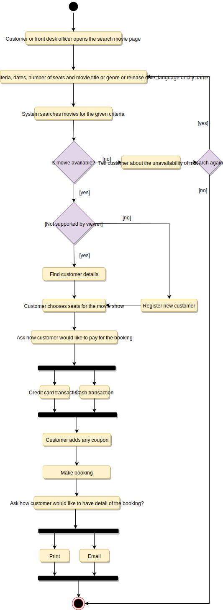

- **Cancel a booking:** Customer can cancel their bookings. Here are the steps to cancel a booking:


### Code

Here are the high-level definitions for the classes described above.

**Enums, data types, and constants:** Here are the required enums, data types, and constants:

```java
public enum BookingStatus {
    REQUESTED, PENDING, CONFIRMED, CHECKED_IN, CANCELED, ABANDONED
}

public enum SeatType {
    REGULAR, PREMIUM, ACCESSIBLE, SHIPPED, EMERGENCY_EXIT, OTHER
}

public enum AccountStatus {
    ACTIVE, BLOCKED, BANNED, COMPROMISED, ARCHIVED, UNKNOWN
}

public enum PaymentStatus {
    UNPAID, PENDING, COMPLETED, FILLED, DECLINED, CANCELLED, ABANDONED, SETTLING, SETTLED, REFUNDED
}

public class Address {
    private String streetAddress;
    private String city;
    private String state;
    private String zipCode;
    private String country;
}
```

**Account, Customer, Admin, FrontDeskOfficer, and Guest:** These classes represent the different people that interact
with our system:

```java
// For simplicity, we are not defining getter and setter functions. The reader can
// assume that all class attributes are private and accessed through their respective
// public getter method and modified only through their public setter method.

public class Account {
    private String id;
    private String password;
    private AccountStatus status;

    public boolean resetPassword();
}

public abstract class Person {
    private String name;
    private Address address;
    private String email;
    private String phone;

    private Account account;
}

public class Customer extends Person {
    public boolean makeBooking(Booking booking);

    public List<Booking> getBookings();
}

public class Admin extends Person {
    public boolean addMovie(Movie movie);

    public boolean addShow(Show show);

    public boolean blockUser(Customer customer);
}

public class FrontDeskOfficer extends Person {
    public boolean createBooking(Booking booking);
}

public class Guest {
    public bool registerAccount();
}
```

**Show and Movie:** A movie will have many shows:

```java
public class Show {
    private int showId;
    private Date createdOn;
    private Date startTime;
    private Date endTime;
    private CinemaHall playedAt;
    private Movie movie;
}

public class Movie {
    private String title;
    private String description;
    private int durationInMins;
    private String language;
    private Date releaseDate;
    private String country;
    private String genre;
    private Admin movieAddedBy;

    private List<Show> shows;

    public List<Show> getShows();
}
```

**Booking, ShowSeat, and Payment:** Customers will reserve seats with a booking and make a payment:

```java
public class Booking {
    private String bookingNumber;
    private int numberOfSeats;
    private Date createdOn;
    private BookingStatus status;

    private Show show;
    private List<ShowSeat> seats;
    private Payment payment;

    public boolean makePayment(Payment payment);

    public boolean cancel();

    public boolean assignSeats(List<ShowSeat> seats);
}

public class ShowSeat extends CinemaHallSeat {
    private int showSeatId;
    private boolean isReserved;
    private double price;
}

public class Payment {
    private double amount;
    private Date createdOn;
    private int transactionId;
    private PaymentStatus status;
}
```

**City, Cinema, and CinemaHall:** Each city can have many cinemas and each cinema can have many cinema halls:

```java
public class City {
    private String name;
    private String state;
    private String zipCode;
}

public class Cinema {
    private String name;
    private int totalCinemaHalls;
    private Address location;

    private List<CinemaHall> halls;
}

public class CinemaHall {
    private String name;
    private int totalSeats;

    private List<CinemaHallSeat> seats;
    private List<Show> shows;
}
```

**Search interface and Catalog:** Catalog will implement Search to facilitate searching of products.

```java
public interface Search {
    public List<Movie> searchByTitle(String title);

    public List<Movie> searchByLanguage(String language);

    public List<Movie> searchByGenre(String genre);

    public List<Movie> searchByReleaseDate(Date relDate);

    public List<Movie> searchByCity(String cityName);
}

public class Catalog implements Search {
    HashMap<String, List<Movie>> movieTitles;
    HashMap<String, List<Movie>> movieLanguages;
    HashMap<String, List<Movie>> movieGenres;
    HashMap<Date, List<Movie>> movieReleaseDates;
    HashMap<String, List<Movie>> movieCities;

    public List<Movie> searchByTitle(String title) {
        return movieTitles.get(title);
    }

    public List<Movie> searchByLanguage(String language) {
        return movieLanguages.get(language);
    }

//...

    public List<Movie> searchByCity(String cityName) {
        return movieCities.get(cityName);
    }
}
```

### Concurrency

**How to handle concurrency; such that no two users are able to book the same seat?** We can use transactions in SQL
databases to avoid any clashes. For example, if we are using SQL server we can
utilize[Transaction Isolation Levels](https://docs.microsoft.com/en-us/sql/odbc/reference/develop-app/transaction-isolation-levels)
to lock the rows before we update them. Note: within a transaction, if we read rows we get a write-lock on them so that
they can’t be updated by anyone else. Here is the sample code:

```
SET TRANSACTION ISOLATION LEVEL SERIALIZABLE;
 
BEGIN TRANSACTION;
 
    -- Suppose we intend to reserve three seats (IDs: 54, 55, 56) for ShowID=99 
    Select * From ShowSeat where ShowID=99 && ShowSeatID in (54, 55, 56) && isReserved=0 
 
    -- if the number of rows returned by the above statement is NOT three, we can return failure to the user.
    update ShowSeat table...
    update Booking table ...
 
COMMIT TRANSACTION;
```

‘Serializable’ is the highest isolation level and guarantees safety
from [Dirty](https://en.wikipedia.org/wiki/Isolation_%28database_systems%29#Dirty_reads), [Nonrepeatable](https://en.wikipedia.org/wiki/Isolation_%28database_systems%29#Non-repeatable_reads),
and [Phantoms](https://en.wikipedia.org/wiki/Isolation_%28database_systems%29#Phantom_reads) reads.

Once the above database transaction is successful, we can safely assume that the reservation has been marked
successfully and no two customers will be able to reserve the same seat.

Here is the sample Java code:

```java
import java.sql.DriverManager;
import java.sql.Connection;
import java.sql.PreparedStatement;
import java.sql.SQLException;
import java.sql.ResultSet;

public class Customer extends Person {

    public boolean makeBooking(Booking booking) {
        List<ShowSeat> seats = booking.getSeats();
        Integer seatIds[] = new Integer[seats.size()];
        int index = 0;
        for (ShowSeat seat : seats) {
            seatIds[index++] = seat.getShowSeatId();
        }

        Connection dbConnection = null;
        try {
            dbConnection = getDBConnection();
            dbConnection.setAutoCommit(false);
// ‘Serializable’ is the highest isolation level and guarantees safety from
// Dirty, Nonrepeatable, and Phantoms reads
            dbConnection.setTransactionIsolation(Connection.TRANSACTION_SERIALIZABLE);

            Statement st = dbConnection.createStatement();
            String selectSQL = "Select * From ShowSeat where ShowID=? && ShowSeatID in (?) && isReserved=0";
            PreparedStatement preparedStatement = dbConnection.prepareStatement(selectSQL);
            preparedStatement.setInt(1, booking.getShow().getShowId());
            Array array = dbConnection.createArrayOf("INTEGER", seatIds);
            preparedStatement.setArray(2, array);

            ResultSet rs = preparedStatement.executeQuery();
// With TRANSACTION_SERIALIZABLE all the read rows will have the write lock, so we can
// safely assume that no one else is modifying them.
            if (rs.next()) {
                rs.last(); // move to the last row, to calculate the row count
                int rowCount = rs.getRow();
// check if we have expected number of rows, if not, this means another process is
// trying to process at least one of the same row, if that is the case we
// should not process this booking.
                if (rowCount == seats.size()) {
                    // update ShowSeat table...
                    // update Booking table ...
                    dbConnection.commit();
                    return true;
                }
            }
        } catch (SQLException e) {
            dbConnection.rollback();
            System.out.println(e.getMessage());
        }
        return false;
    }
}
```

Read [JDBC Transaction Isolation Levels](https://docs.microsoft.com/en-us/sql/connect/jdbc/understanding-isolation-levels?view=sql-server-2017)
for details.

# Design an ATM

An automated teller machine (ATM) is an electronic telecommunications instrument that provides the clients of a
financial institution with access to financial transactions in a public space without the need for a cashier or bank
teller. ATMs are necessary as not all the bank branches are open all days of the week, and some customers may not be in
a position to visit a bank each time they want to withdraw or deposit money.


ATM

### Requirements and Goals of the System

The main components of the ATM that will affect interactions between the ATM and its users are:

1. **Card reader:** to read the users’ ATM cards.
2. **Keypad:** to enter information into the ATM e.g. PIN. cards.
3. **Screen:** to display messages to the users.
4. **Cash dispenser:** for dispensing cash.
5. **Deposit slot:** For users to deposit cash or checks.
6. **Printer:** for printing receipts.
7. **Communication/Network Infrastructure:** it is assumed that the ATM has a communication infrastructure to
   communicate with the bank upon any transaction or activity.

The user can have two types of accounts: 1) Checking, and 2) Savings, and should be able to perform the following five
transactions on the ATM:

1. **Balance inquiry:** To see the amount of funds in each account.
2. **Deposit cash:** To deposit cash.
3. **Deposit check:** To deposit checks.
4. **Withdraw cash** To withdraw money from their checking account.
5. **Transfer funds:** To transfer funds to another account.

### How ATM works?

The ATM will be managed by an operator, who operates the ATM and refills it with cash and receipts. The ATM will serve
one customer at a time and should not shut down while serving. To begin a transaction in the ATM, the user should insert
their ATM card, which will contain their account information. Then, the user should enter their Personal Identification
Number (PIN) for authentication. The ATM will send the user’s information to the bank for authentication; without
authentication, the user cannot perform any transaction/service.

The user’s ATM card will be kept in the ATM until the user ends a session. For example, the user can end a session at
any time by pressing the cancel button, and the ATM Card will be ejected. The ATM will maintain an internal log of
transactions that contains information about hardware failures; this log will be used by the ATM operator to resolve any
issues.

1. Identify the system user through their PIN.
2. In the case of depositing checks, the amount of the check will not be added instantly to the user account; it is
   subject to manual verification and bank approval.
3. It is assumed that the bank manager will have access to the ATM’s system information stored in the bank database.
4. It is assumed that user deposits will not be added to their account immediately because it will be subject to
   verification by the bank.
5. It is assumed the ATM card is the main player when it comes to security; users will authenticate themselves with
   their debit card and security pin.

### Use cases

Here are the actors of the ATM system and their use cases:

**Operator:** The operator will be responsible for the following operations:

1. Turning the ATM ON/OFF using the designated Key-Switch.
2. Refilling the ATM with cash.
3. Refilling the ATM’s printer with receipts.
4. Refilling the ATM’s printer with INK.
5. Take out deposited cash and checks.

**Customer:** The ATM customer can perform the following operations:

1. Balance inquiry: the user can view his/her account balance.
2. Cash withdrawal: the user can withdraw a certain amount of cash.
3. Deposit funds: the user can deposit cash or checks.
4. Transfer funds: the user can transfer funds to other accounts.

**Bank Manager:** The Bank Manager can perform the following operations:

1. Generate a report to check total deposits.
2. Generate a report to check total withdrawals.
3. Print total deposits/withdrawal reports.
4. Checks the remaining cash in the ATM.

Here is the use case diagram of our ATM system:

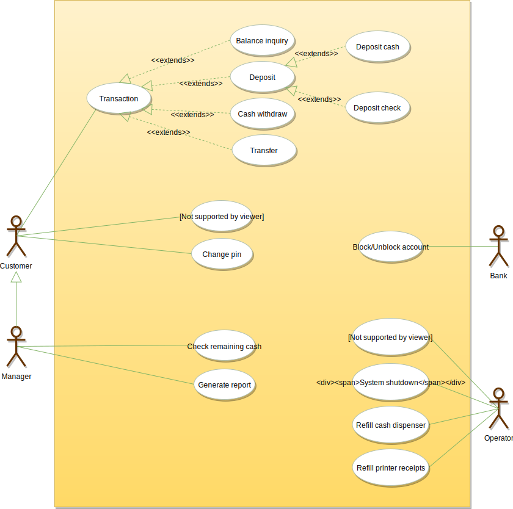

ATM use case diagram

### Class diagram

Here are the main classes of the ATM System:

- **ATM:** The main part of the system for which this software has been designed. It has attributes like ‘atmID’ to
  distinguish it from other available ATMs, and ‘location’ which defines the physical address of the ATM.
- **CashReader:** To encapsulate the ATM’s card reader used for user authentication.
- **CashDispenser:** To encapsulate the ATM component which will dispense cash.
- **Keypad:** The user will use the ATM’s keypad to enter their PIN or amounts.
- **Screen:** Users will be shown all messages on the screen and they will select different transactions by touching the
  screen.
- **Printer:** To print receipts.
- **DepositSlot:** User can deposit checks or cash through the deposit slot.
- **Bank:** To encapsulate the bank which ownns the ATM. The bank will hold all the account information and the ATM will
  communicate with the bank to perform customer transactions.
- **Account:** We’ll have two types of accounts in the system: 1)Checking and 2)Saving.
- **Customer:** This class will encapsulate the ATM’s customer. It will have the customer’s basic information like name,
  email, etc.
- **Card:** Encapsulating the ATM card that the customer will use to authenticate themselves. Each customer can have one
  card.
- **Transaction:** Encapsulating all transactions that the customer can perform on the ATM, like BalanceInquiry,
  Deposit, Withdraw, etc.


Class diagram for ATM


### Activity Diagram

**Customer authentication:** Following is the activity diagram for a customer authenticating themselves to perform an
ATM transaction:

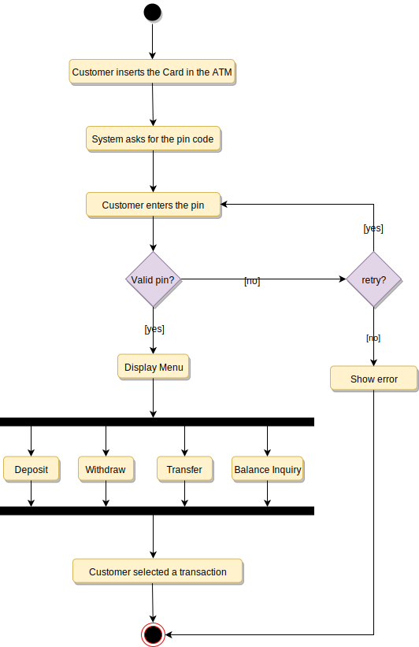

Activity Diagram - Customer Authentication

**Withdraw:** Following is the activity diagram for a user withdrawing cash:

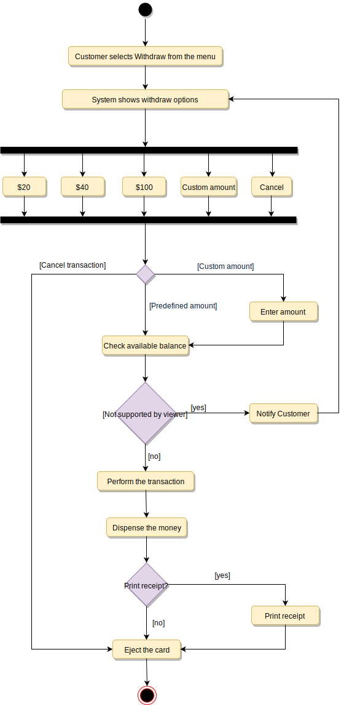

Activity Diagram - Cash Withdraw

**Deposit check:** Following is the activity diagram for the customer depositing a check:

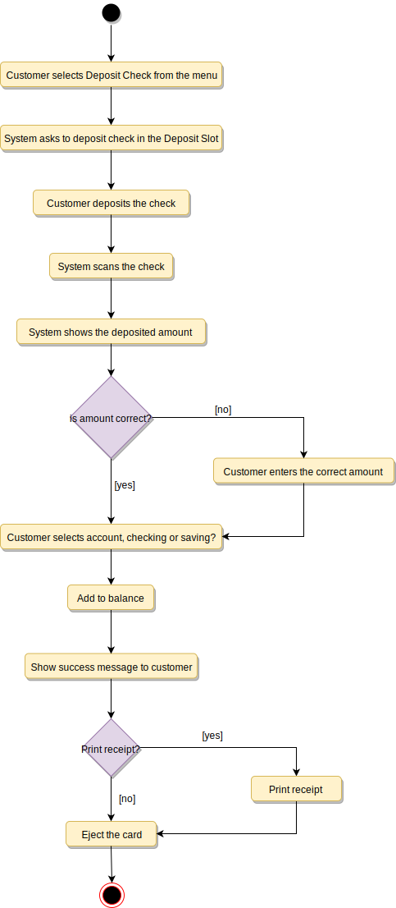

Activity Diagram - Deposit Check

**Transfer:** Following is the activity diagram for a user transferring funds to another account:


Activity Diagram - Transfer funds

### Sequence Diagram

Here is the sequence diagram for balance inquiry transaction:

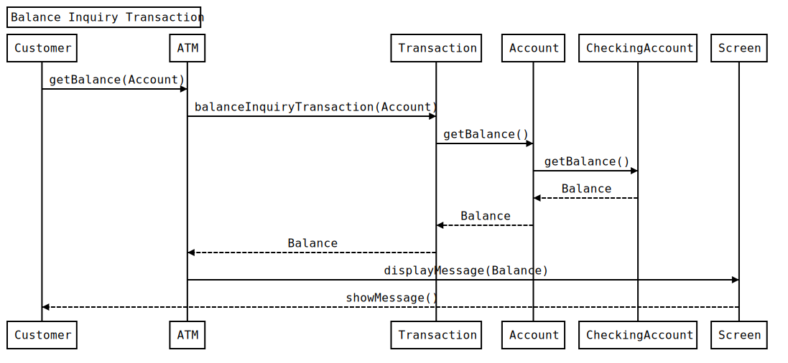

### Code

Here is the skeleton code for the classes defined above:

**Enums and Constants:** Here are the required enums, data types, and constants:

```java
public enum TransactionType {
    BALANCE_INQUIRY, DEPOSIT_CASH, DEPOSIT_CHECK, WITHDRAW, TRANSFER
}

public enum TransactionStatus {
    SUCCESS, FAILURE, BLOCKED, FULL, PARTIAL, NONE
}

public enum CustomerStatus {
    ACTIVE, BLOCKED, BANNED, COMPROMISED, ARCHIVED, CLOSED, UNKNOWN
}

public class Address {
    private String streetAddress;
    private String city;
    private String state;
    private String zipCode;
    private String country;
}
```

**Customer, Card, and Account:** “Customer” encapsulates the ATM user, “Card” the ATM card, and “Account” can be of two
types: checking and savings:

```java
// For simplicity, we are not defining getter and setter functions. The reader can
// assume that all class attributes are private and accessed through their respective
// public getter method and modified only through their public setter function.

public class Customer {
    private String name;
    private String email;
    private String phone;
    private Address address;
    private CustomerStatus status;

    private Card card;
    private Account account;

    public boolean makeTransaction(Transaction transaction);

    public Address getBillingAddress();
}

public class Card {
    private String cardNumber;
    private String customerName;
    private Date cardExpiry;
    private int pin;

    public Address getBillingAddress();
}

public class Account {
    private int accountNumber;
    private double totalBalance;
    private double availableBalance;

    public double getAvailableBalance();
}

public class SavingAccount extends Account {
    private double withdrawLimit;
}

public class CheckingAccount extends Account {
    private String debitCardNumber;
}
```

**Bank, ATM, CashDispenser, Keypad, Screen, Printer and DepositSlot:** The ATM will have different components like
keypad, screen, etc.

```java
public class Bank {
    private String name;
    private String bankCode;

    public String getBankCode();

    public boolean addATM();
}

public class ATM {
    private int atmID;
    private Address location;

    private CashDispenser cashDispenser;
    private Keypad keypad;
    private Screen screen;
    private Printer printer;
    private CheckDeposit checkDeposit;
    private CashDeposit cashDeposit;

    public boolean authenticateUser();

    public boolean makeTransaction(Customer customer, Transaction transaction);
}

public class CashDispenser {
    private int totalFiveDollarBills;
    private int totalTwentyDollarBills;

    public boolean dispenseCash(double amount);

    public boolean canDispenseCash();
}

public class Keypad {
    public String getInput();
}

public class Screen {
    public boolean showMessage(String message);

    public TransactionType getInput();
}

public class Printer {
    public boolean printReceipt(Transaction transaction);
}

public abstract class DepositSlot {
    private double totalAmount;

    public double getTotalAmount();
}

public class CheckDepositSlot extends DepositSlot {
    public double getCheckAmount();
}

public class CashDepositSlot extends DepositSlot {
    public double receiveDollarBill();
}
```

**Transaction and its subclasses:** Customers can perform different transactions on the ATM, these classes encapsulate
them:

```java
public abstract class Transaction {
    private int transactionId;
    private Date creationTime;
    private TransactionStatus status;

    public boolean makeTransation();
}

public class BalanceInquiry extends Transaction {
    private int accountId;

    public double getAccountId();
}

public abstract class Deposit extends Transaction {
    private double amount;

    public double getAmount();
}

public class CheckDeposit extends Deposit {
    private String checkNumber;
    private String bankCode;

    public String getCheckNumber();
}

public class CashDeposit extends Deposit {
    private double cashDepositLimit;
}

public class Withdraw extends Transaction {
    private double amount;

    public double getAmount();
}

public class Transfer extends Transaction {
    private int destinationAccountNumber;

    public int getDestinationAccount();
}
```

# Design an Airline Management System

An Airline Management System is a managerial software which targets to control all operations of an airline. Airlines
provide transport services for their passengers. They carry or hire aircraft for this purpose. All operations of an
airline company are controlled by their airline management system.

This system involves the scheduling of flights, air ticket reservations, flight cancellations, customer support, and
staff management. Daily flights updates can also be retrieved by using the system.


### System Requirements

We will focus on the following set of requirements while designing the Airline Management System:

1. Customers should be able to search for flights for a given date and source/destination airport.
2. Customers should be able to reserve a ticket for any scheduled flight. Customers can also build a multi-flight
   itinerary.
3. Users of the system can check flight schedules, their departure time, available seats, arrival time, and other flight
   details.
4. Customers can make reservations for multiple passengers under one itinerary.
5. Only the admin of the system can add new aircrafts, flights, and flight schedules. Admin can cancel any pre-scheduled
   flight (all stakeholders will be notified).
6. Customers can cancel their reservation and itinerary.
7. The system should be able to handle the assignment of pilots and crew members to flights.
8. The system should be able to handle payments for reservations.
9. The system should be able to send notifications to customers whenever a reservation is made/modified or there is an
   update for their flights.

### Use case diagram

We have five main Actors in our system:

- **Admin:** Responsible for adding new flights and their schedules, canceling any flight, maintaining staff-related
  work, etc.
- **Front desk officer:** Will be able to reserve/cancel tickets.
- **Customer:** Can view flight schedule, reserve and cancel tickets.
- **Pilot/Crew:** Can view their assigned flights and their schedules.
- **System:** Mainly responsible for sending notifications regarding itinerary changes, flight status updates, etc.

Here are the top use cases of the Airline Management System:

- **Search Flights:** To search the flight schedule to find flights for a suitable date and time.
- **Create/Modify/View reservation:** To reserve a ticket, cancel it, or view details about the flight or ticket.
- **Assign seats to passengers:** To assign seats to passengers for a flight instance with their reservation.
- **Make payment for a reservation:** To pay for the reservation.
- **Update flight schedule:** To make changes in the flight schedule, and to add or remove any flight.
- **Assign pilots and crew:** To assign pilots and crews to flights.

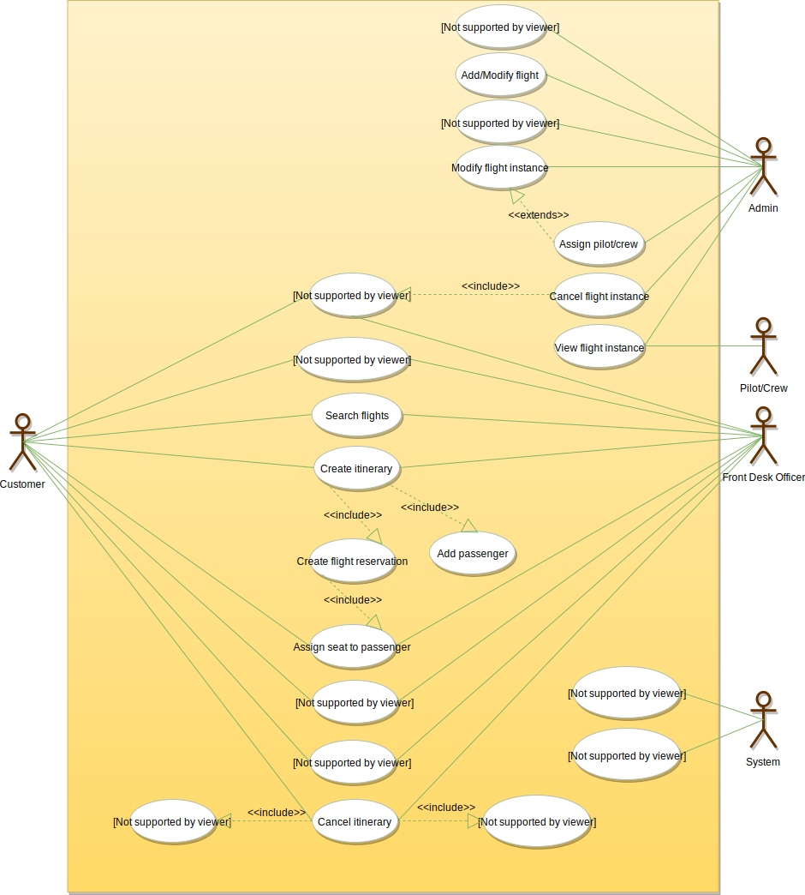

Use case diagram

### Class diagram

Here are the main classes of our Airline Management System:

- **Airline:** The main part of the organization for which this software has been designed. It has attributes like
  ‘name’ and an airline code to distinguish the airline from other airlines.
- **Airport:** Each airline operates out of different airports. Each airport has a name, address, and a unique code.
- **Aircraft:** Airlines own or hire aircraft to carry out their flights. Each aircraft has attributes like name, model,
  manufacturing year, etc.
- **Flight:** The main entity of the system. Each flight will have a flight number, departure and arrival airport,
  assigned aircraft, etc.
- **FlightInstance:** Each flight can have multiple occurrences; each occurrence will be considered a flight instance in
  our system. For example, if a British Airways flight from London to Tokyo (flight number: BA212) occurs twice a week,
  each of these occurrences will be considered a separate flight instance in our system.
- **WeeklySchedule and CustomSchedule:** Flights can have multiple schedules and each schedule will create a flight
  instance.
- **FlightReservation:** A reservation is made against a flight instance and has attributes like a unique reservation
  number, list of passengers and their assigned seats, reservation status, etc.
- **Itinerary:** An itinerary can have multiple flights.
- **FlightSeat:** This class will represent all seats of an aircraft assigned to a specific flight instance. All
  reservations of this flight instance will assign seats to passengers through this class.
- **Payment:** Will be responsible for collecting payments from customers.
- **Notification:** This class will be responsible for sending notifications for flight reservations, flight status
  update, etc.

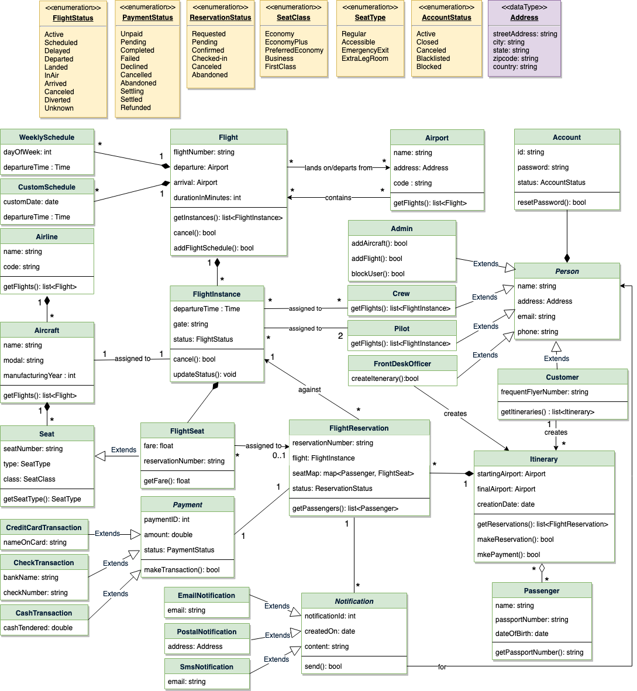

Class diagram


### Activity diagrams

- **Reserve a ticket:** Any customer can perform this activity. Here are the steps to reserve a ticket:

<!--THE END-->


- **Cancel a reservation:** Any customer can perform this activity. Here are the set of steps to cancel a reservation:

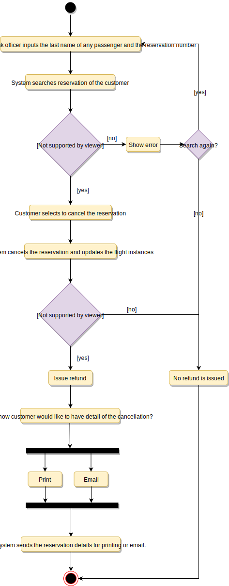

### Code

Here is the code for major classes.

**Enums and Constants:** Here are the required enums, data types, and constants:

```java
public enum FlightStatus {
    ACTIVE,
    SCHEDULED,
    DELAYED,
    DEPARTED,
    LANDED,
    IN_AIR,
    ARRIVED,
    CANCELLED,
    DIVERTED,
    UNKNOWN
}

public enum PaymentStatus {
    UNPAID,
    PENDING,
    COMPLETED,
    FILLED,
    DECLINED,
    CANCELLED,
    ABANDONED,
    SETTLING,
    SETTLED,
    REFUNDED
}

public enum ReservationStatus {
    REQUESTED,
    PENDING,
    CONFIRMED,
    CHECKED_IN,
    CANCELLED,
    ABANDONED
}

public enum SeatClass {
    ECONOMY,
    ECONOMY_PLUS,
    PREFERRED_ECONOMY,
    BUSINESS,
    FIRST_CLASS
}

public enum SeatType {
    REGULAR,
    ACCESSIBLE,
    EMERGENCY_EXIT,
    EXTRA_LEG_ROOM
}

public enum AccountStatus {
    ACTIVE,
    CLOSED,
    CANCELED,
    BLACKLISTED,
    BLOCKED
}

public class Address {
    private String streetAddress;
    private String city;
    private String state;
    private String zipCode;
    private String country;
}
```

**Account, Person, Customer and Passenger:** These classes represent the different people that interact with our system:

```java
// For simplicity, we are not defining getter and setter functions. The reader can
// assume that all class attributes are private and accessed through their respective
// public getter method and modified only through their public setter method.

public class Account {
    private String id;
    private String password;
    private AccountStatus status;

    public boolean resetPassword();
}

public abstract class Person {
    private String name;
    private Address address;
    private String email;
    private String phone;

    private Account account;
}

public class Customer extends Person {
    private String frequentFlyerNumber;

    public List<Itinerary> getItineraries();
}

public class Passenger {
    private String name;
    private String passportNumber;
    private Date dateOfBirth;

    public String getPassportNumber() {
        return this.passportNumber;
    }
}
```

**Airport, Aircraft, Seat and FlightSeat:** These classes represent the top-level classes of the system:

```java
public class Airport {
    private String name;
    private Address address;
    private String code;

    public List<Flight> getFlights();
}

public class Aircraft {
    private String name;
    private String model;
    private int manufacturingYear;
    private List<Seat> seats;

    public List<FlightInstance> getFlights();
}

public class Seat {
    private String seatNumber;
    private SeatType type;
    private SeatClass _class;
}

public class FlightSeat extends Seat {
    private double fare;

    public double getFare();
}
```

**Flight Schedule classes, Flight, FlightInstance, FlightReservation, Itinerary:** Here are the classes related to
flights and reservations:

```java
public class WeeklySchedule {
    private int dayOfWeek;
    private Time departureTime;
}

public class CustomSchedule {
    private Date customDate;
    private Time departureTime;
}

public class Flight {
    private String flightNumber;
    private Airport departure;
    private Airport arrival;
    private int durationInMinutes;

    private List<WeeklySchedules> weeklySchedules;
    private List<CustomSchedules> customSchedules;
    private List<FlightInstance> flightInstances;
}

public class FlightInstance {
    private Date departureTime;
    private String gate;
    private FlightStatus status;
    private Aircraft aircraft;

    public bool cancel();

    public void updateStatus(FlightStatus status);
}

public class FlightReservation {
    private String reservationNumber;
    private FlightInstance flight;
    private Map<Passenger, FlightSeat> seatMap;
    private Date creationDate;
    private ReservationStatus status;

    public static FlightReservation fetchReservationDetails(String reservationNumber);

    public List<Passenger> getPassengers();
}

public class Itinerary {
    private String customerId;
    private Airport startingAirport;
    private Airport finalAirport;
    private Date creationDate;
    private List<FlightReservation> reservations;

    public List<FlightReservation> getReservations();

    public boolean makeReservation();

    public boolean makePayment();
}
```

# Design Blackjack and a Deck of Cards

Let's design a game of Blackjack.

Blackjack is the most widely played casino game in the world. It falls under the category of comparing-card games and is
usually played between several players and a dealer. Each player, in turn, competes against the dealer, but players do
not play against each other. In Blackjack, all players and the dealer try to build a hand that totals 21 points without
going over. The hand closest to 21 wins.

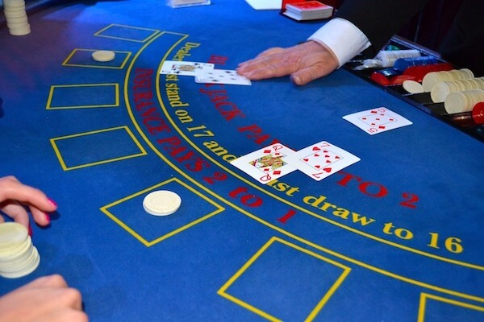

### System Requirements

Blackjack is played with one or more standard 52-card decks. The standard deck has 13 ranks in 4 suits.

**Background**

- To start with, the players and the dealer are dealt separate hands. Each hand has two cards in it.
- The dealer has one card exposed (the up card) and one card concealed (the hole card), leaving the player with
  incomplete information about the state of the game.
- The player’s objective is to make a hand that has more points than the dealer, but less than or equal to 21 points.
- The player is responsible for placing bets when they are offered, and taking additional cards to complete their hand.
- The dealer will draw additional cards according to a simple rule: when the dealer’s hand is 16 or less, they will draw
  cards (called a hit), when it is 17 or more, they will not draw additional cards (or stand pat).

**Points calculation**

Blackjack has different point values for each of the cards:

- The number cards (2-10) have the expected point values.
- The face cards (Jack, Queen, and King) all have a value of 10 points.
- The Ace can count as one point or eleven points. Because of this, an Ace and a 10 or face card totals 21. This
  two-card winner is called “blackjack”.
- When the points include an ace counting as 11, the total is called soft-total; when the ace counts as 1, the total is
  called hard-total. For example, A+5 can be considered a soft 16 or a hard 6.

**Gameplay**

1. The player places an initial bet.
2. The player and dealer are each dealt a pair of cards.
3. Both of the player’s cards are face up, the dealer has one card up and one card down.
4. If the dealer’s card is an ace, the player is offered insurance.

Initially, the player has a number of choices:

- If the two cards are the same rank, the player can elect to split into two hands.
- The player can double their bet and take just one more card.
- The more typical scenario is for the player to take additional cards (a hit ) until either their hand totals more than
  21 (they bust ), or their hand totals exactly 21, or they elect to stand.

If the player’s hand is over 21, their bet is resolved immediately as a loss. If the player’s hand is 21 or less, it
will be compared to the dealer’s hand for resolution.

**Dealer has an Ace.** If the dealer’s up card is an ace, the player is offered an insurance bet. This is an additional
proposition that pays 2:1 if the dealer’s hand is exactly 21. If this insurance bet wins, it will, in effect, cancel the
loss of the initial bet. After offering insurance to the player, the dealer will check their hole card and resolve the
insurance bets. If the hole card is a 10-point card, the dealer has blackjack, the card is revealed, and insurance bets
are paid. If the hole card is not a 10-point card, the insurance bets are lost, but the card is not revealed.

**Split Hands.** When dealt two cards of the same rank, the player can split the cards to create two hands. This
requires an additional bet on the new hand. The dealer will deal an additional card to each new hand, and the hands are
played independently. Generally, the typical scenario described above applies to each of these hands.

**Bets**

- Ante: This is the initial bet and is mandatory to play.
- Insurance: This bet is offered only when the dealer shows an ace. The amount must be half the ante.
- Split: This can be thought of as a bet that is offered only when the player’s hand has two cards of equal rank. The
  amount of the bet must match the original ante.
- Double: This can be thought of as a bet that is offered instead of taking an ordinary hit. The amount of the bet must
  match the original ante.

### Use case diagram

We have two main Actors in our system:

- **Dealer:** Mainly responsible for dealing cards and game resolution.
- **Player:** Places the initial bets, accepts or declines additional bets - including insurance, and splits hands.
  Accepts or rejects the offered resolution, including even money. Chooses among hit, double and stand pat options.

**Typical Blackjack Game Use cases**

Here are the top use cases of the Blackjack game:

- **Create Hands:** Initially both the player and the dealer are given two cards each. The player has both cards visible
  whereas only one card of the dealer’s hand is visible to the player.
- **Place Bet:** To start the game, the player has to place a bet.
- **Player plays the hand:** If the hand is under 21 points, the player has three options:

    - Hit: The hand gets an additional card and this process repeats.
    - Double Down: The player creates an additional bet, and the hand gets one more card and play is done.
    - Stands Pat: If the hand is 21 points or over, or the player chooses to stand pat, the game is over.
    - Resolve Bust. If a hand is over 21, it is resolved as a loser.
- **Dealer plays the hand:** The dealer keeps getting a new card if the total point value of the hand is 16 or less, and
  stops dealing cards at the point value of 17 or more.

    - Dealer Bust: If the dealer’s hand is over 21, the player’s wins the game. Player Hands with two cards totaling
      21 ( “blackjack” ) are paid 3:2, all other hands are paid 1:1.
- **Insurance:** If the dealer’s up card is an Ace, then the player is offered insurance:

    - Offer Even Money: If the player’s hand totals to a soft 21, a blackjack; the player is offered an even money
      resolution. If the player accepts, the entire game is resolved at this point. The ante is paid at even money;
      there is no insurance bet.
    - Offer Insurance: The player is offered insurance, which they can accept by creating a bet. For players with
      blackjack, this is the second offer after even money is declined. If the player declines, there are no further
      insurance considerations.
    - Examine Hole Card: The dealer’s hole card is examined. If it has a 10-point value, the insurance bet is resolved
      as a winner, and the game is over. Otherwise, the insurance is resolved as a loser, the hole card is not revealed,
      and play continues.
- **Split:** If the player’s hand has both cards of equal rank, the player is offered a split. The player accepts by
  creating an additional Bet. The original hand is removed; The two original cards are split and then the dealer deals
  two extra cards to create two new Hands. There will not be any further splitting.
- **Game Resolution:** The Player’s Hand is compared against the Dealer’s Hand, and the hand with the higher point value
  wins. In the case of a tie, the bet is returned. When the player wins, a winning hand with two cards totaling 21 (
  “blackjack”) is paid 3:2, any other winning hand is paid 1:1.

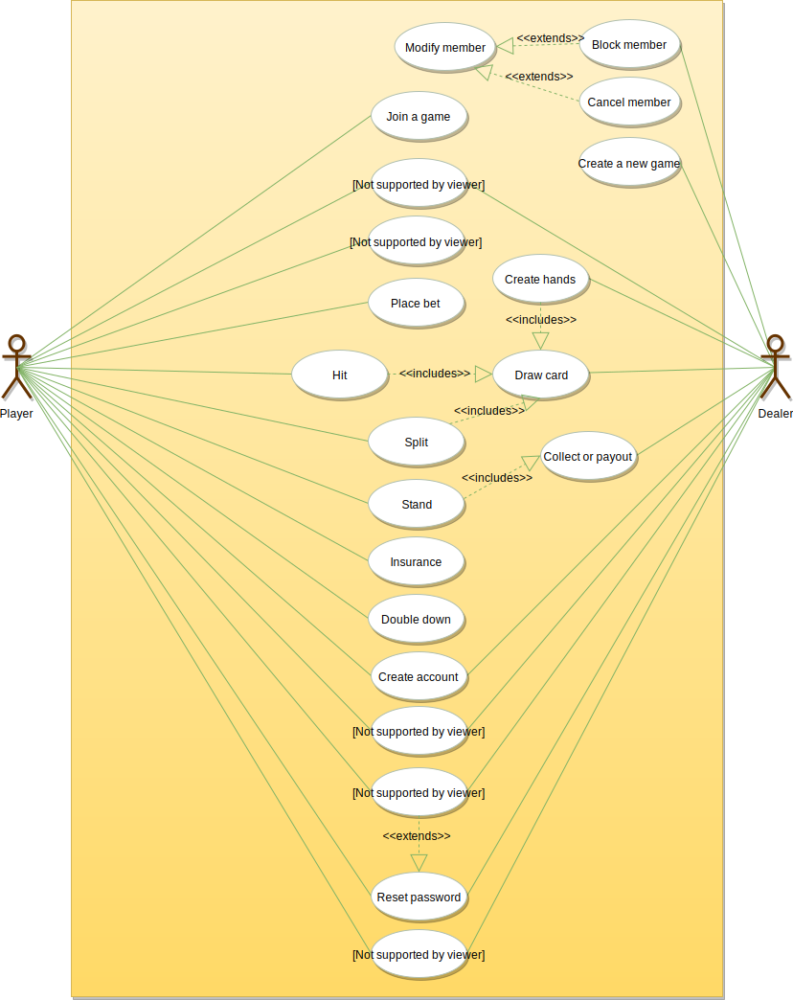

Use case diagram

### Class diagram

Here are the main classes of our Blackjack game:

- **Card:** A standard playing card has a suit and point value from 1 to 11.
- **BlackjackCard:** In blackjack, cards have different face values. For example, jack, queen, and king, all have a face
  value of 10. An ace can be counted as either 1 or 11.
- **Deck:** A standard playing card deck has 52 cards and 4 suits.
- **Shoe:** Contains a set of decks. In casinos, a dealer’s shoe is a gaming device to hold multiple decks of playing
  cards.
- **Hand:** A collection of cards with one or two point values: a hard value (when an ace counts as 1) and a soft
  value (when an ace counts as 11).
- **Player:** Places the initial bets, updates the stake with amounts won and lost. Accepts or declines offered
  additional bets - including insurance, and split hands. Accepts or declines offered resolution, including even money.
  Chooses between hit, double and stand options.
- **Game:** This class encapsulates the basic sequence of play. It runs the game, offers bets to players, deals the
  cards from the shoe to hands, updates the state of the game, collects losing bets, pays winning bets, splits hands,
  and responds to player choices of a hit, double or stand.


Class diagram


### Activity diagrams

**Blackjack hit or stand:** Here are the set of steps to play blackjack with hit or stand:

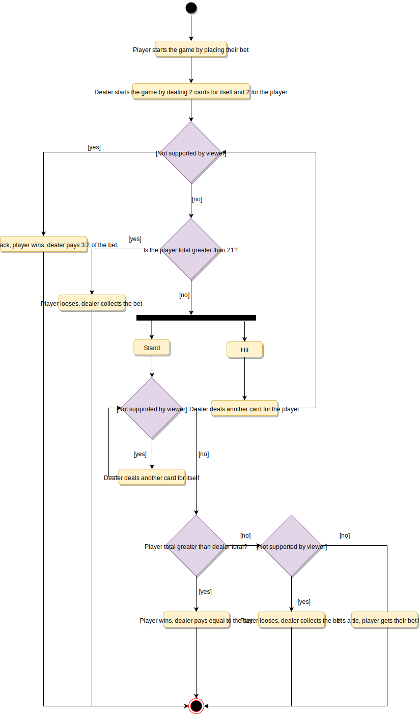

### Code

**Enums:** Here are the required enums:

```java
public enum SUIT {
    HEART, SPADE, CLUB, DIAMOND
}
```

**Card:** The following class encapsulates a playing card:

```java
public class Card {
    private SUIT suit;
    private int faceValue;

    public SUIT getSuit() {
        return suit;
    }

    public int getFaceValue() {
        return faceValue;
    }

    Card(SUIT suit, int faceValue) {
        this.suit = suit;
        this.faceVale = faceValue;
    }
}
```

**BlackjackCard:** BlackjackCard extends from Card class to represent a blackjack card:

```java
public class BlackjackCard extends Card {
    private int gameValue;

    public int getGameValue() {
        return gameValue;
    }

    public BlackjackCard(SUIT suit, int faceValue) {
        super(suit, faceValue);
        this.gameValue = faceValue;
        if (this.gameValue > 10) {
            this.gameValue = 10;
        }
    }
}
```

**Deck and Shoe:** Shoe contains cards from multiple decks:

```java
public class Deck {
    private List<BlackjackCard> cards;
    private Date creationDate;

    public Deck() {
        this.creationDate = new Date();
        this.cards = new ArrayList<BlackjackCard>();
        for (int value = 1; value <= 13; value++) {
            for (SUIT suit : SUIT.values()) {
                this.cards.add(new BlackjackCard(suit, value));
            }
        }
    }

    public List<BlackjackCard> getCards() {
        return cards;
    }

    public class Shoe {
        private List<BlackjackCard> cards;
        private int numberOfDecks;

        private void createShoe() {
            this.cards = new ArrayList<BlackjackCard>();
            for (int decks = 0; decks < numberOfDecks; decks++) {
                cards.add(new Deck().getCards());
            }
        }

        public Shoe(int numberOfDecks) {
            this.numberOfDecks = numberOfDecks;
            createShoe();
            shuffle();
        }

        public void shuffle() {
            int cardCount = cards.size();
            Random r = new Random();
            for (int i = 0; i < cardCount; i++) {
                int index = r.nextInt(cardCount - i - 1);
                swap(i, index);
            }
        }

        public void swap(int i, int j) {
            BlackjackCard temp = cards[i];
            cards[i] = cards[j];
            cards[j] = temp;
        }

        //Get the next card from the shoe
        public BlackjackCard dealCard() {
            if (cards.size() == 0) {
                createShoe();
            }
            return cards.remove(0);
        }
    }
}
```

**Hand:** Hand class encapsulates a blackjack hand which can contain multiple cards:

```java
public class Hand {
    private ArrayList<BlackjackCard> cards;

    private List<Integer> getScores() {
        List<Integer> totals = new ArrayList();
        total.add(0);

        for (BlackjackCard card : cards) {
            List<Integer> newTotals = new ArrayList();
            for (int score : totals) {
                newTotals.add(card.faceValue() + score);
                if (card.faceValue() == 1) {
                    newTotals.add(11 + score);
                }
            }
            totals = newTotals;
        }
        return totals;
    }

    public Hand(BlackjackCard c1, BlackjackCard c2) {
        this.cards = new ArrayList<BlackjackCard>();
        this.cards.add(c1);
        this.cards.add(c2);
    }

    public void addCard(BlackjackCard card) {
        cards.add(card);
    }

    // get highest score which is less than or equal to 21
    public int resolveScore() {
        List<Integer> scores = getScores();
        int bestScore = 0;
        for (int score : scores) {
            if (score <= 21 && score > bestScore) {
                bestScore = score;
            }
        }
        return bestScore;
    }
}
```

**Player:** Player class extends from BasePlayer:

```java
public abstract class BasePlayer {
    private String id;
    private String password;
    private double balance;
    private AccountStatus status;
    private Person person;
    private List<Hand> hands;

    public boolean resetPassword();

    public List<Hand> getHands() {
        return hands;
    }

    public void addHand(Hand hand) {
        return hands.add(hand);
    }

    public void removeHand(Hand hand) {
        hands.remove(hand);
    }
}

public class Player extends BasePlayer {
    private int bet;
    private int totalCash;

    public Player(Hand hand) {
        this.hands = new ArrayList<Hand>();
        this.hands.add(hand);
    }
}
```

**Game:** This class encapsulates a blackjack game:

```java
public class Game {
    private Player player;
    private Dealer dealer;
    private Shoe shoe;
    private final int MAX_NUM_OF_DECKS = 3;

    private void playAction(string action, Hand hand) {
        switch (action) {
            case "hit":
                hit(hand);
                break;
            case "split":
                split(hand);
                break;
            case "stand pat":
                break; //do nothing
            case "stand":
                stand();
                break;
            default:
                print("Wrong input");
        }
    }

    private void hit(Hand hand) {
        hand.addCard(shoe.dealCard());
    }

    private void stand() {
        int dealerScore = dealer.getTotalScore();
        int playerScore = player.getTotalScore();
        List<Hand> hands = player.getHands();
        for (Hand hand : hands) {
            int bestScore = hand.resolveScore();
            if (playerScore == 21) {
//blackjack, pay 3:2 of the bet
            } else if (playerScore > dealerScore) {
// pay player equal to the bet
            } else if (playerScore < dealerScore) {
// collect the bet from the player
            } else { //tie
// bet goes back to player
            }
        }
    }

    private void split(Hand hand) {
        Cards cards = hand.getCards();
        player.addHand(new Hand(cards[0], shoe.dealCard()));
        player.addHand(new Hand(cards[1], shoe.dealCard()));
        player.removeHand(hand);
    }


    public Game(Player player, Dealer dealer) {
        this.player = player;
        this.dealer = dealeer;
        Shoe shoe = new Shoe(MAX_NUM_OF_DECKS);
    }

    public void start() {
        player.placeBet(getBetFromUI());

        Hand playerHand = new Hand(shoe.dealCard(), shoe.dealCard());
        player.addToHand(playerHand);

        Hand dealerHand = new Hand(shoe.dealCard(), shoe.dealCard());
        dealer.addToHand(dealerHand);

        while (true) {
            List<Hand> hands = player.getHands();
            for (Hand hand : hands) {
                string action = getUserAction(hand);
                playAction(action, hand);
                if (action.equals("stand")) {
                    break;
                }
            }
        }
    }

    public static void main(String args[]) {
        Player player = new Player();
        Dealer dealer = new Dealer();
        Game game = new Game(player, dealer);
        game.start();
    }
}

```

# Design a Hotel Management System

Let's design a hotel management system.

A Hotel Management System is a software built to handle all online hotel activities easily and safely. This System will
give the hotel management power and flexibility to manage the entire system from a single online portal. The system
allows the manager to keep track of all the available rooms in the system as well as to book rooms and generate bills.


### System Requirements

We’ll focus on the following set of requirements while designing the Hotel Management System:

1. The system should support the booking of different room types like standard, deluxe, family suite, etc.
2. Guests should be able to search the room inventory and book any available room.
3. The system should be able to retrieve information, such as who booked a particular room, or what rooms were booked by
   a specific customer.
4. The system should allow customers to cancel their booking - and provide them with a full refund if the cancelation
   occurs before 24 hours of the check-in date.
5. The system should be able to send notifications whenever the booking is nearing the check-in or check-out date.
6. The system should maintain a room housekeeping log to keep track of all housekeeping tasks.
7. Any customer should be able to add room services and food items.
8. Customers can ask for different amenities.
9. The customers should be able to pay their bills through credit card, check or cash.

### Use case diagram

Here are the main Actors in our system:

- **Guest:** All guests can search the available rooms, as well as make a booking.
- **Receptionist:** Mainly responsible for adding and modifying rooms, creating room bookings, check-in, and check-out
  customers.
- **System:** Mainly responsible for sending notifications for room booking, cancellation, etc.
- **Manager:** Mainly responsible for adding new workers.
- **Housekeeper:** To add/modify housekeeping record of rooms.
- **Server:** To add/modify room service record of rooms.

Here are the top use cases of the Hotel Management System:

- **Add/Remove/Edit room:** To add, remove, or modify a room in the system.
- **Search room:** To search for rooms by type and availability.
- **Register or cancel an account:** To add a new member or cancel the membership of an existing member.
- **Book room:** To book a room.
- **Check-in:** To let the guest check-in for their booking.
- **Check-out:** To track the end of the booking and the return of the room keys.
- **Add room charge:** To add a room service charge to the customer’s bill.
- **Update housekeeping log:** To add or update the housekeeping entry of a room.


Use case diagram

### Class diagram

Here are the main classes of our Hotel Management System:

- **Hotel and HotelLocation:** Our system will support multiple locations of a hotel.
- **Room:** The basic building block of the system. Every room will be uniquely identified by the room number. Each Room
  will have attributes like Room Style, Booking Price, etc.
- **Account:** We will have different types of accounts in the system: one will be a guest to search and book rooms,
  another will be a receptionist. Housekeeping will keep track of the housekeeping records of a room, and a Server will
  handle room service.
- **RoomBooking:** This class will be responsible for managing bookings for a room.
- **Notification:** Will take care of sending notifications to guests.
- **RoomHouseKeeping:** To keep track of all housekeeping records for rooms.
- **RoomCharge:** Encapsulates the details about different types of room services that guests have requested.
- **Invoice:** Contains different invoice-items for every charge against the room.
- **RoomKey:** Each room can be assigned an electronic key card. Keys will have a barcode and will be uniquely
  identified by a key-ID.


Class diagram


### Activity diagrams

**Make a room booking:** Any guest or receptionist can perform this activity. Here are the set of steps to book a room:

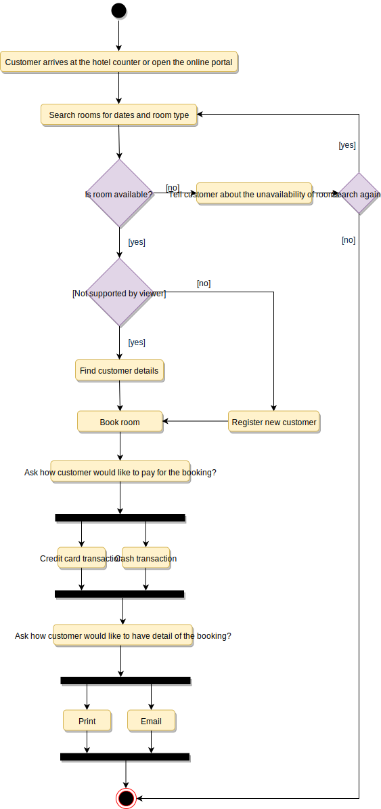

**Check in:** Guest will check in for their booking. The Receptionist can also perform this activity. Here are the
steps:

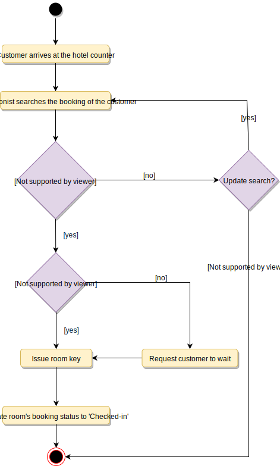

**Cancel a booking:** Guest can cancel their booking. Receptionist can perform this activity. Here are the different
steps of this activity:

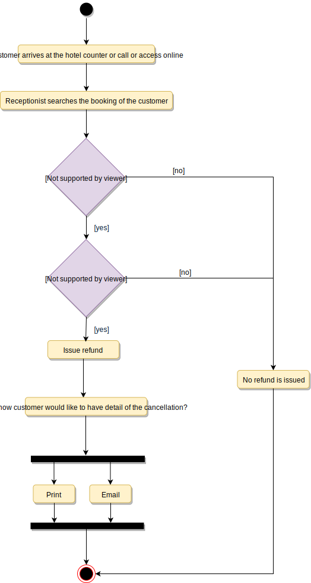

### Code

Here is the high-level definition for the classes described above.

**Enums, data types, and constants:** Here are the required enums, data types, and constants:

```java
public enum RoomStyle {
    STANDARD, DELUXE, FAMILY_SUITE, BUSINESS_SUITE
}

public enum RoomStatus {
    AVAILABLE, RESERVED, OCCUPIED, NOT_AVAILABLE, BEING_SERVICED, OTHER
}

public enum BookingStatus {
    REQUESTED, PENDING, CONFIRMED, CHECKED_IN, CHECKED_OUT, CANCELLED, ABANDONED
}

public enum AccountStatus {
    ACTIVE, CLOSED, CANCELED, BLACKLISTED, BLOCKED
}

public enum AccountType {
    MEMBER, GUEST, MANAGER, RECEPTIONIST
}

public enum PaymentStatus {
    UNPAID, PENDING, COMPLETED, FILLED, DECLINED, CANCELLED, ABANDONED, SETTLING, SETTLED, REFUNDED
}

public class Address {
    private String streetAddress;
    private String city;
    private String state;
    private String zipCode;
    private String country;
}
```

**Account, Person, Guest, Receptionist, and Server:** These classes represent the different people that interact with
our system:

```java
// For simplicity, we are not defining getter and setter functions. The reader can
// assume that all class attributes are private and accessed through their respective
// public getter method and modified only through their public setter method.

public class Account {
    private String id;
    private String password;
    private AccountStatus status;

    public boolean resetPassword();
}

public abstract class Person {
    private String name;
    private Address address;
    private String email;
    private String phone;

    private Account account;
}


public class Guest extends Person {
    private int totalRoomsCheckedIn;

    public List<RoomBooking> getBookings();
}

public class Receptionist extends Person {
    public List<Member> searchMember(String name);

    public boolean createBooking();
}

public class Server extends Person {
    public boolean addRoomCharge(Room room, RoomCharge roomCharge);
}
```

**Hotel and HotelLocation:** These classes represent the top-level classes of the system:

```java
public class HotelLocation {
    private String name;
    private Address location;

    public Address getRooms();
}

public class Hotel {
    private String name;
    private List<HotelLocation> locations;

    public boolean addLocation(HotelLocation location);
}
```

**Room, RoomKey, and RoomHouseKeeping:** To encapsulate a room, room key, and housekeeping:

```java
public interface Search {
    public static List<Room> search(RoomStyle style, Date startDate, int duration);
}

public class Room implements Search {
    private String roomNumber;
    private RoomStyle style;
    private RoomStatus status;
    private double bookingPrice;
    private boolean isSmoking;

    private List<RoomKey> keys;
    private List<RoomHouseKeeping> houseKeepingLog;

    public boolean isRoomAvailable();

    public boolean checkIn();

    public boolean checkOut();

    public static List<Room> search(RoomStyle style, Date startDate, int duration) {
// return all rooms with the given style and availability
    }
}

public class RoomKey {
    private String keyId;
    private String barcode;
    private Date issuedAt;
    private boolean active;
    private boolean isMaster;

    public boolean assignRoom(Room room);

    public boolean isActive();
}

public class RoomHouseKeeping {
    private String description;
    private Date startDatetime;
    private int duration;
    private HouseKeeper houseKeeper;

    public boolean addHouseKeeping(Room room);
}
```

**RoomBooking and RoomCharge:** To encapsulate a booking and different charges against a booking:

```java
public class RoomBooking {
    private String reservationNumber;
    private Date startDate;
    private int durationInDays;
    private BookingStatus status;
    private Date checkin;
    private Date checkout;

    private int guestID;
    private Room room;
    private Invoice invoice;
    private List<Notification> notifications;

    public static RoomBooking fectchDetails(String reservationNumber);
}

public abstract class RoomCharge {
    public Date issueAt;

    public boolean addInvoiceItem(Invoice invoice);
}

public class Amenity extends RoomCharge {
    public String name;
    public String description;
}

public class RoomService extends RoomCharge {
    public boolean isChargeable;
    public Date requestTime;
}

public class KitchenService extends RoomCharge {
    public String description;
}
```

# Design a Restaurant Management system

Let's design a restaurant management system.

A Restaurant Management System is a software built to handle all restaurant activities in an easy and safe manner. This
System will give the Restaurant management power and flexibility to manage the entire system from a single portal. The
system allows the manager to keep track of available tables in the system as well as the reservation of tables and bill
generation.


### System Requirements

We will focus on the following set of requirements while designing the Restaurant Management System:

01. The restaurant will have different branches.
02. Each restaurant branch will have a menu.
03. The menu will have different menu sections, containing different menu items.
04. The waiter should be able to create an order for a table and add meals for each seat.
05. Each meal can have multiple meal items. Each meal item corresponds to a menu item.
06. The system should be able to retrieve information about tables currently available to seat walk-in customers.
07. The system should support the reservation of tables.
08. The receptionist should be able to search for available tables by date/time and reserve a table.
09. The system should allow customers to cancel their reservation.
10. The system should be able to send notifications whenever the reservation time is approaching.
11. The customers should be able to pay their bills through credit card, check or cash.
12. Each restaurant branch can have multiple seating arrangements of tables.

### Use case diagram

Here are the main Actors in our system:

- **Receptionist:** Mainly responsible for adding and modifying tables and their layout, and creating and canceling
  table reservations.
- **Waiter:** To take/modify orders.
- **Manager:** Mainly responsible for adding new workers and modifying the menu.
- **Chef:** To view and work on an order.
- **Cashier:** To generate checks and process payments.
- **System:** Mainly responsible for sending notifications about table reservations, cancellations, etc.

Here are the top use cases of the Restaurant Management System:

- **Add/Modify tables:** To add, remove, or modify a table in the system.
- **Search tables:** To search for available tables for reservation.
- **Place order:** Add a new order in the system for a table.
- **Update order:** Modify an already placed order, which can include adding/modifying meals or meal items.
- **Create a reservation:** To create a table reservation for a certain date/time for an available table.
- **Cancel reservation:** To cancel an existing reservation.
- **Check-in:** To let the guest check in for their reservation.
- **Make payment:** Pay the check for the food.

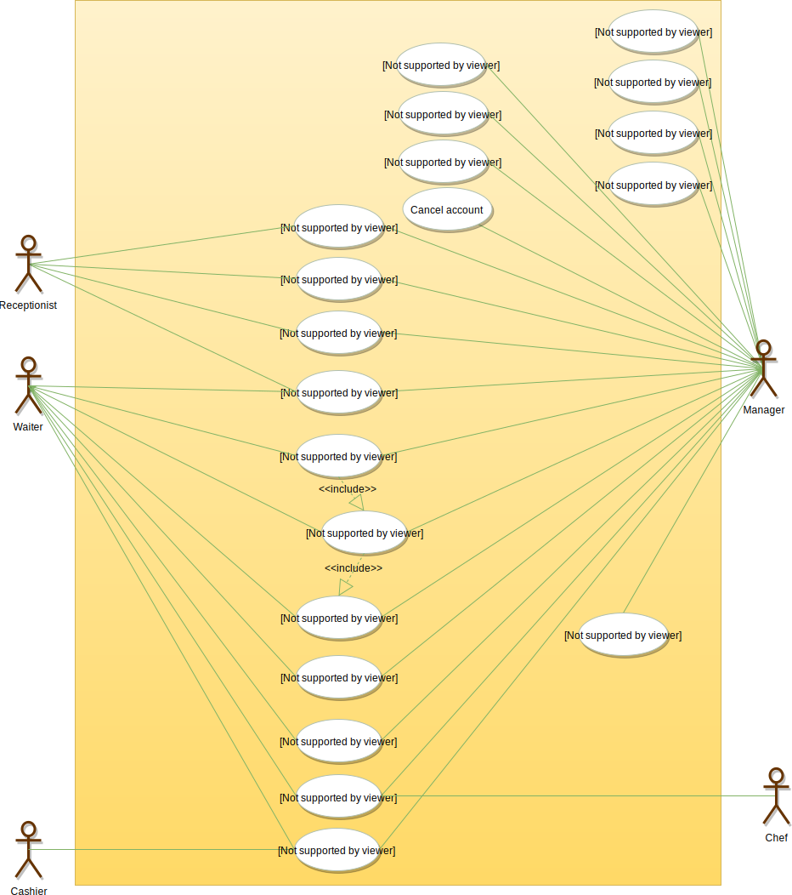

Use case diagram

### Class diagram

Here is the description of the different classes of our Restaurant Management System:

- **Restaurant:** This class represents a restaurant. Each restaurant has registered employees. The employees are part
  of the restaurant because if the restaurant becomes inactive, all its employees will automatically be deactivated.
- **Branch:** Any restaurants can have multiple branches. Each branch will have its own set of employees and menus.
- **Menu:** All branches will have their own menu.
- **MenuSection and MenuItem:** A menu has zero or more menu sections. Each menu section consists of zero or more menu
  items.
- **Table and TableSeat:** The basic building block of the system. Every table will have a unique identifier, maximum
  sitting capacity, etc. Each table will have multiple seats.
- **Order:** This class encapsulates the order placed by a customer.
- **Meal:** Each order will consist of separate meals for each table seat.
- **Meal Item:** Each Meal will consist of one or more meal items corresponding to a menu item.
- **Account:** We’ll have different types of accounts in the system, one will be a receptionist to search and reserve
  tables and the other, the waiter will place orders in the system.
- **Notification:** Will take care of sending notifications to customers.
- **Bill:** Contains different bill-items for every meal item.


Class diagram


### Activity diagrams

**Place order:** Any waiter can perform this activity. Here are the steps to place an order:

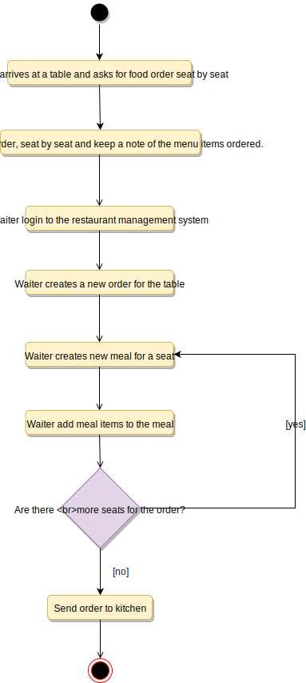

**Make a reservation:** Any receptionist can perform this activity. Here are the steps to make a reservation:

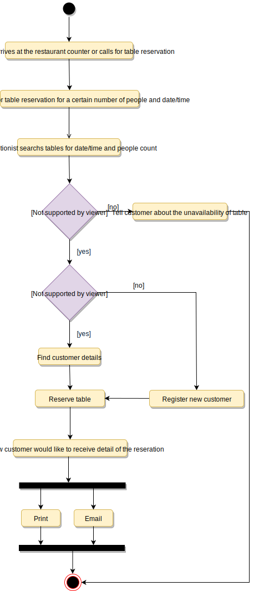

**Cancel a reservation:** Any receptionist can perform this activity. Here are the steps to cancel a reservation:

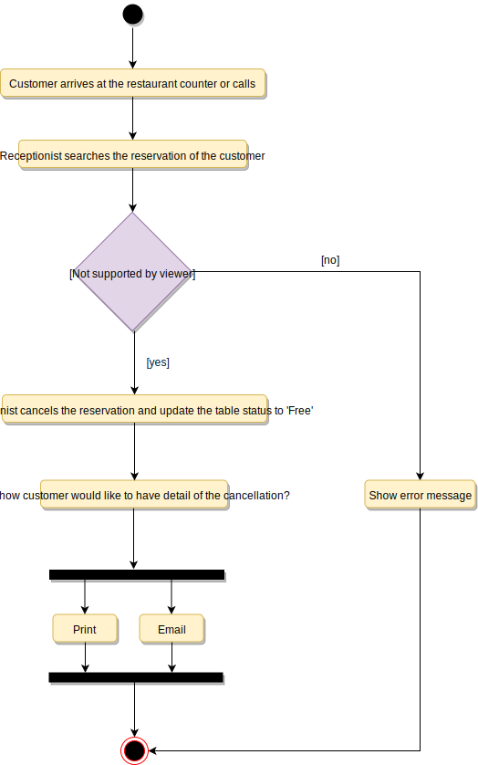

### Code

Here is the high-level definition for the classes described above.

**Enums, data types, and constants:** Here are the required enums, data types, and constants:

```java
public enum ReservationStatus {
    REQUESTED, PENDING, CONFIRMED, CHECKED_IN, CANCELED, ABANDONED
}

public enum SeatType {
    REGULAR, KID, ACCESSIBLE, OTHER
}

public enum OrderStatus {
    RECEIVED, PREPARING, COMPLETED, CANCELED, NONE
}

public enum TableStatus {
    FREE, RESERVED, OCCUPIED, OTHER
}

public enum AccountStatus {
    ACTIVE, CLOSED, CANCELED, BLACKLISTED, BLOCKED
}

public enum PaymentStatus {
    UNPAID, PENDING, COMPLETED, FILLED, DECLINED, CANCELLED, ABANDONED, SETTLING, SETTLED, REFUNDED
}

public class Address {
    private String streetAddress;
    private String city;
    private String state;
    private String zipCode;
    private String country;
}
```

**Account, Person, Employee, Receptionist, Manager, and Chef:** These classes represent the different people that
interact with our system:

```java
// For simplicity, we are not defining getter and setter functions. The reader can
// assume that all class attributes are private and accessed through their respective
// public getter methods and modified only through their public setter function.

public class Account {
    private String id;
    private String password;
    private Address address;
    private AccountStatus status;

    public boolean resetPassword();
}

public abstract class Person {
    private String name;
    private String email;
    private String phone;
}


public abstract class Employee extends Person {
    private int employeeID;
    private Date dateJoined;

    private Account account;
}

public class Receptionist extends Employee {
    public boolean createReservation();

    public List<Customer> searchCustomer(String name);
}

public class Manager extends Employee {
    public boolean addEmployee();
}

public class Chef extends Employee {
    public boolean takeOrder();
}
```

**Restaurant, Branch, Kitchen, TableChart:** These classes represent the top-level classes of the system:

```java
public class Kitchen {
    private String name;
    private Chef[] chefs;

    private boolean assignChef();
}

public class Branch {
    private String name;
    private Address location;
    private Kitchen kitchen;

    public Address addTableChart();
}

public class Restaurant {
    private String name;
    private List<Branch> branches;

    public boolean addBranch(Branch branch);
}

public class TableChart {
    private int tableChartID;
    private byte[] tableChartImage;

    public bool print();
}
```

**Table, TableSeat, and Reservation:** Each table can have multiple seats and customers can make reservations for
tables:

```java
public class Table {
    private int tableID;
    private TableStatus status;
    private int maxCapacity;
    private int locationIdentifier;

    private List<TableSeat> seats;

    public boolean isTableFree();

    public boolean addReservation();

    public static List<Table> search(int capacity, Date startTime) {
// return all tables with the given capacity and availability
    }
}

public class TableSeat {
    private int tableSeatNumber;
    private SeatType type;

    public boolean updateSeatType(SeatType type);
}

public class Reservation {
    private int reservationID;
    private Date timeOfReservation;
    private int peopleCount;
    private ReservationStatus status;
    private String notes;
    private Date checkinTime;
    private Customer customer;

    private Table[] tables;
    private List<Notification> notifications;

    public boolean updatePeopleCount(int count);
}
```

**Menu, MenuSection, and MenuItem:** Each restaurant branch will have its own menu, each menu will have multiple menu
sections, which will contain menu items:

```java
public class MenuItem {
    private int menuItemID;
    private String title;
    private String description;
    private double price;

    public boolean updatePrice(double price);
}

public class MenuSection {
    private int menuSectionID;
    private String title;
    private String description;
    private List<MenuItem> menuItems;

    public boolean addMenuItem(MenuItem menuItem);
}

public class Menu {
    private int menuID;
    private String title;
    private String description;
    private List<MenuSection> menuSections;

    public boolean addMenuSection(MenuSection menuSection);

    public boolean print();
}
```

**Order, Meal, and MealItem:** Each order will have meals for table seats:

```java
public class MealItem {
    private int mealItemID;
    private int quantity;
    private MenuItem menuItem;

    public boolean updateQuantity(int quantity);
}

public class Meal {
    private int mealID;
    private TableSeat seat;
    private List<MenuItem> menuItems;

    public boolean addMealItem(MealItem mealItem);
}

public class Order {
    private int OrderID;
    private OrderStatus status;
    private Date creationTime;

    private Meal[] meals;
    private Table table;
    private Check check;
    private Waiter waiter;
    private Chef chef;

    public boolean addMeal(Meal meal);

    public boolean removeMeal(Meal meal);

    public OrderStatus getStatus();

    public boolean setStatus(OrderStatus status);
}
```

# Design Chess

Let's design a system to play online chess.

Chess is a two-player strategy board game played on a chessboard, which is a checkered gameboard with 64 squares
arranged in an 8×8 grid. There are a few versions of game types that people play all over the world. In this design
problem, we are going to focus on designing a two-player online chess game.


### System Requirements

We’ll focus on the following set of requirements while designing the game of chess:

1. The system should support two online players to play a game of chess.
2. All rules of international chess will be followed.
3. Each player will be randomly assigned a side, black or white.
4. Both players will play their moves one after the other. The white side plays the first move.
5. Players can’t cancel or roll back their moves.
6. The system should maintain a log of all moves by both players.
7. Each side will start with 8 pawns, 2 rooks, 2 bishops, 2 knights, 1 queen, and 1 king.
8. The game can finish either in a checkmate from one side, forfeit or stalemate (a draw), or resignation.

### Use case diagram

We have two actors in our system:

- **Player:** A registered account in the system, who will play the game. The player will play chess moves.
- **Admin:** To ban/modify players.

Here are the top use cases for chess:

- **Player moves a piece:** To make a valid move of any chess piece.
- **Resign or forfeit a game:** A player resigns from/forfeits the game.
- **Register new account/Cancel membership:** To add a new member or cancel an existing member.
- **Update game log:** To add a move to the game log.

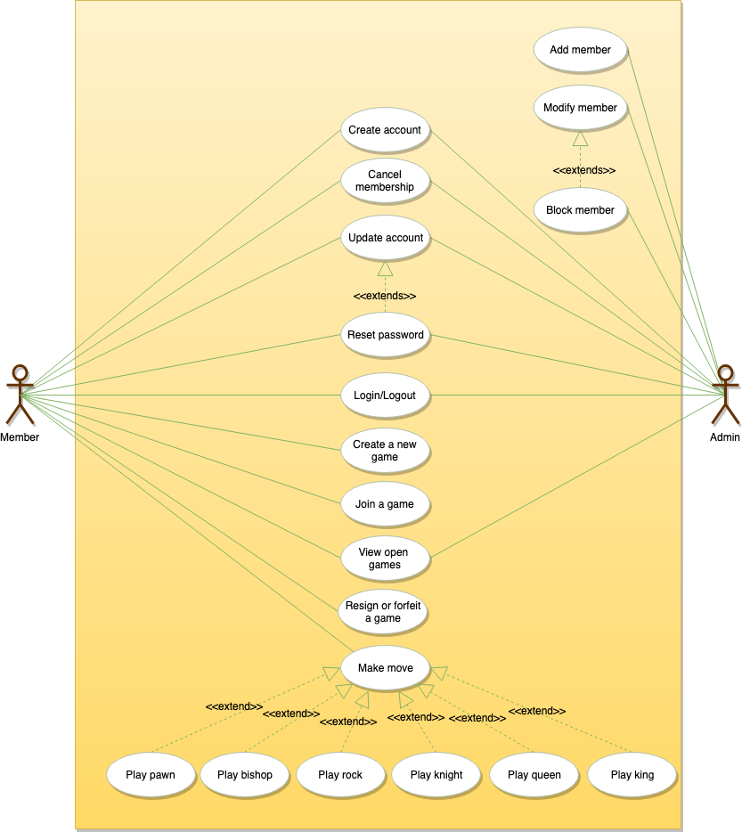

Use case diagram

### Class diagram

Here are the main classes for chess:

- **Player:** Player class represents one of the participants playing the game. It keeps track of which side (black or
  white) the player is playing.
- **Account:** We’ll have two types of accounts in the system: one will be a player, and the other will be an admin.
- **Game:** This class controls the flow of a game. It keeps track of all the game moves, which player has the current
  turn, and the final result of the game.
- **Box:** A box represents one block of the 8x8 grid and an optional piece.
- **Board:** Board is an 8x8 set of boxes containing all active chess pieces.
- **Piece:** The basic building block of the system, every piece will be placed on a box. This class contains the color
  the piece represents and the status of the piece (that is, if the piece is currently in play or not). This would be an
  abstract class and all game pieces will extend it.
- **Move:** Represents a game move, containing the starting and ending box. The Move class will also keep track of the
  player who made the move, if it is a castling move, or if the move resulted in the capture of a piece.
- **GameController:** Player class uses GameController to make moves.
- **GameView:** Game class updates the GameView to show changes to the players.


Class diagram


### Activity diagrams

**Make move:** Any Player can perform this activity. Here are the set of steps to make a move:

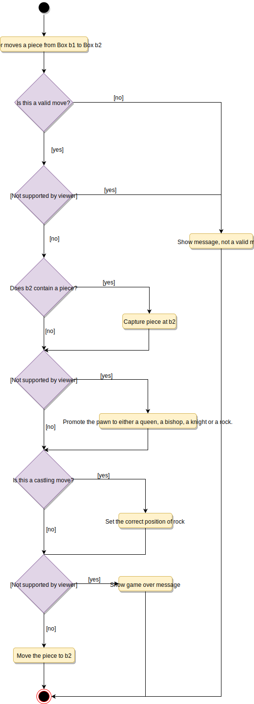

### Code

Here is the code for the top use cases.

**Enums, DataTypes, Constants:** Here are the required enums, data types, and constants:

```java
public enum GameStatus {
    ACTIVE, BLACK_WIN, WHITE_WIN, FORFEIT, STALEMATE, RESIGNATION
}

public enum AccountStatus {
    ACTIVE, CLOSED, CANCELED, BLACKLISTED, NONE
}

public class Address {
    private String streetAddress;
    private String city;
    private String state;
    private String zipCode;
    private String country;
}

public class Person {
    private String name;
    private Address address;
    private String email;
    private String phone;
}
```

**Box:** To encapsulate a cell on the chess board:

```java
public class Box {
    private Piece piece;
    private int x;
    private int y;

    public Box(int x, int y, Piece piece) {
        this.setPiece(piece);
        this.setX(x);
        this.setY(y);
    }

    public Piece getPiece() {
        return this.piece;
    }

    public void setPiece(Piece p) {
        this.piece = p;
    }

    public int getX() {
        return this.x;
    }

    public void setX(int x) {
        this.x = x;
    }

    public int getY() {
        return this.y;
    }

    public void setY(int y) {
        this.y = y;
    }
}
```

**Piece:** An abstract class to encapsulate common functionality of all chess pieces:

```java
public abstract class Piece {

    private boolean killed = false;
    private boolean white = false;

    public Piece(boolean white) {
        this.setWhite(white);
    }

    public boolean isWhite() {
        return this.white == true;
    }

    public void setWhite(boolean white) {
        this.white = white;
    }

    public boolean isKilled() {
        return this.killed == true;
    }

    public void setKilled(boolean killed) {
        this.killed = killed;
    }

    public abstract boolean canMove(Board board, Box start, Box end);
}
```

**King:** To encapsulate King as a chess piece:

```java
public class King extends Piece {
    private boolean castlingDone = false;

    public King(boolean white) {
        super(white);
    }

    public boolean isCastlingDone() {
        return this.castlingDone == true;
    }

    public void setCastlingDone(boolean castlingDone) {
        this.castlingDone = castlingDone;
    }

    @Override
    public boolean canMove(Board board, Box start, Box end) {
// we can't move the piece to a box that has a piece of the same color
        if (end.getPiece().isWhite() == this.isWhite()) {
            return false;
        }

        int x = Math.abs(start.getX() - end.getX());
        int y = Math.abs(start.getY() - end.getY());
        if (x + y == 1) {
// check if this move will not result in king being attacked, if so return true
            return true;
        }

        return this.isValidCastling(board, start, end);
    }

    private boolean isValidCastling(Board board, Box start, Box end) {

        if (this.isCastlingDone()) {
            return false;
        }

// check for the white king castling
        if (this.isWhite()
                && start.getX() == 0 && start.getY() == 4 && end.getY() == 0) {
// confirm if white king moved to the correct ending box
            if (Math.abs(end.getY() - start.getY()) == 2) {
                // check if there the Rook is in the correct position
                // check if there is no piece between Rook and the King
                // check if the King or the Rook has not moved before
                // check if this move will not result in king being attacked
                //...
                this.setCastlingDone(true);
                return true;
            }
        } else {
// check for the black king castling
            this.setCastlingDone(true);
            return true;
        }

        return false;
    }

    public boolean isCastlingMove(Box start, Box end) {
// check if the starting and ending position are correct
    }
}
```

**Knight:** To encapsulate Knight as a chess piece:

```java
public class Knight extends Piece {
    public Knight(boolean white) {
        super(white);
    }

    @Override
    public boolean canMove(Board board, Box start, Box end) {

// we can't move the piece to a box that has a piece of the same color
        if (end.getPiece().isWhite() == this.isWhite()) {
            return false;
        }

        int x = Math.abs(start.getX() - end.getX());
        int y = Math.abs(start.getY() - end.getY());
        return x * y == 2;
    }
}

```

**Board:** To encapsulate a chess board:

```java
public class Board {
    Box[][] boxes;

    public Board() {
        this.resetBoard();
    }

    public Box getBox(int x, int y) {

        if (x < 0 || x > 7 || y < 0 || y > 7) {
            throw new Exception("Index out of bound");
        }

        return boxes[x][y];
    }

    public void resetBoard() {
// initialize white pieces
        boxes[0][0] = new Box(0, 0, new Rook(true));
        boxes[0][1] = new Box(0, 1, new Knight(true));
        boxes[0][2] = new Box(0, 2, new Bishop(true));
//...
        boxes[1][0] = new Box(1, 0, new Pawn(true));
        boxes[1][1] = new Box(1, 1, new Pawn(true));
//...

// initialize black pieces
        boxes[7][0] = new Box(7, 0, new Rook(false));
        boxes[7][1] = new Box(7, 1, new Knight(false));
        boxes[7][2] = new Box(7, 2, new Bishop(false));
//...
        boxes[6][0] = new Box(6, 0, new Pawn(false));
        boxes[6][1] = new Box(6, 1, new Pawn(false));
//...

// initialize remaining boxes without any piece
        for (int i = 2; i < 6; i++) {
            for (int j = 0; j < 8; j++) {
                boxes[i][j] = new Box(i, j, null);
            }
        }
    }
}
```

**Player:** To encapsulate a chess player:

```java
public class Player extends Account {
    private Person person;
    private boolean whiteSide = false;

    public Player(Person person, boolean whiteSide) {
        this.person = person;
        this.whiteSide = whiteSide;
    }

    public boolean isWhiteSide() {
        return this.whiteSide == true;
    }
}
```

**Move:** To encapsulate a chess move:

```java
public class Move {
    private Player player;
    private Box start;
    private Box end;
    private Piece pieceMoved;
    private Piece pieceKilled;
    private boolean castlingMove = false;

    public Move(Player player, Box start, Box end) {
        this.player = player;
        this.start = start;
        this.end = end;
        this.pieceMoved = start.getPiece();
    }

    public boolean isCastlingMove() {
        return this.castlingMove == true;
    }

    public void setCastlingMove(boolean castlingMove) {
        this.castlingMove = castlingMove;
    }
}
```

**Game:** To encapsulate a chess game:

```java
public class Game {
    private Player[] players;
    private Board board;
    private Player currentTurn;
    private GameStatus status;
    private List<Move> movesPlayed;

    private void initialize(Player p1, Player p2) {
        players[0] = p1;
        players[1] = p2;

        board.resetBoard();

        if (p1.isWhiteSide()) {
            this.currentTurn = p1;
        } else {
            this.currentTurn = p2;
        }

        movesPlayed.clear();
    }

    public boolean isEnd() {
        return this.getStatus() != GameStatus.ACTIVE;
    }

    public boolean getStatus() {
        return this.status;
    }

    public void setStatus(GameStatus status) {
        this.status = status;
    }

    public boolean playerMove(Player player, int startX, int startY, int endX, int endY) {
        Box startBox = board.getBox(startX, startY);
        Box endBox = board.getBox(startY, endY);
        Move move = new Move(player, startBox, endBox);
        return this.makeMove(move, player);
    }

    private boolean makeMove(Move move, Player player) {
        Piece sourcePiece = move.getStart().getPiece();
        if (sourcePiece == null) {
            return false;
        }

// valid player
        if (player != currentTurn) {
            return false;
        }

        if (sourcePiece.isWhite() != player.isWhiteSide()) {
            return false;
        }

// valid move?
        if (!sourcePiece.canMove(board, move.getStart(), move.getEnd())) {
            return false;
        }

// kill?
        Piece destPiece = move.getStart().getPiece();
        if (destPiece != null) {
            destPiece.setKilled(true);
            move.setPieceKilled(destPiece);
        }

// castling?
        if (sourcePiece != null && sourcePiece instanceof King
                && sourcePiece.isCastlingMove()) {
            move.setCastlingMove(true);
        }

// store the move
        movesPlayed.add(move);

// move piece from the stat box to end box
        move.getEnd().setPiece(move.getStart().getPiece());
        move.getStart.setPiece(null);

        if (destPiece != null && destPiece instanceof King) {
            if (player.isWhiteSide()) {
                this.setStatus(GameStatus.WHITE_WIN);
            } else {
                this.setStatus(GameStatus.BLACK_WIN);
            }
        }

// set the current turn to the other player
        if (this.currentTurn == players[0]) {
            this.currentTurn = players[1];
        } else {
            this.currentTurn = players[0];
        }

        return true;
    }
}
```

# Design an Online Stock Brokerage System

Let's design an Online Stock Brokerage System.

An Online Stock Brokerage System facilitates its users the trade (i.e. buying and selling) of stocks online. It allows
clients to keep track of and execute their transactions, and shows performance charts of the different stocks in their
portfolios. It also provides security for their transactions and alerts them to pre-defined levels of changes in stocks,
without the use of any middlemen.

The online stock brokerage system automates traditional stock trading using computers and the internet, making the
transaction faster and cheaper. This system also gives speedier access to stock reports, current market trends, and
real-time stock prices.


### System Requirements

We will focus on the following set of requirements while designing the online stock brokerage system:

1. Any user of our system should be able to buy and sell stocks.
2. Any user can have multiple watchlists containing multiple stock quotes.
3. Users should be able to place stock trade orders of the following types: 1) market, 2) limit, 3) stop loss and, 4)
   stop limit.
4. Users can have multiple ‘lots’ of a stock. This means that if a user has bought a stock multiple times, the system
   should be able to differentiate between different lots of the same stock.
5. The system should be able to generate reports for quarterly updates and yearly tax statements.
6. Users should be able to deposit and withdraw money either via check, wire or electronic bank transfer.
7. The system should be able to send notifications whenever trade orders are executed.

### Usecase diagram

We have three main Actors in our system:

- **Admin:** Mainly responsible for administrative functions like blocking or unblocking members.
- **Member:** All members can search the stock inventory, as well as buy and sell stocks. Members can have multiple
  watchlists containing multiple stock quotes.
- **System:** Mainly responsible for sending notifications for stock orders and periodically fetching stock quotes from
  the stock exchange.

Here are the top use cases of the Stock Brokerage System:

- **Register new account/Cancel membership:** To add a new member or cancel the membership of an existing member.
- **Add/Remove/Edit watchlist:** To add, remove or modify a watchlist.
- **Search stock inventory:** To search for stocks by their symbols.
- **Place order:** To place a buy or sell order on the stock exchange.
- **Cancel order:** Cancel an already placed order.
- **Deposit/Withdraw money:** Members can deposit or withdraw money via check, wire or electronic bank transfer.

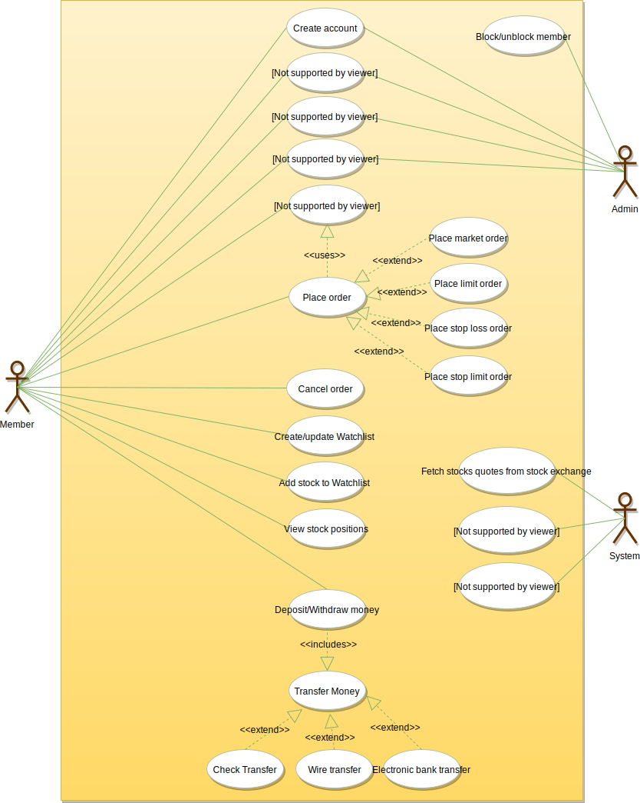

Use case diagram for Stock Brokerage System

### Class diagram

Here are the main classes of our Online Stock Brokerage System:

- **Account:** Consists of the member’s name, address, e-mail, phone, total funds, funds that are available for trading,
  etc. We’ll have two types of accounts in the system: one will be a general member, and the other will be an Admin. The
  Account class will also contain all the stocks the member is holding.
- **StockExchange:** The stockbroker system will fetch all stocks and their current prices from the stock exchange.
  StockExchange will be a singleton class encapsulating all interactions with the stock exchange. This class will also
  be used to place stock trading orders on the stock exchange.
- **Stock:** The basic building block of the system. Every stock will have a symbol, current trading price, etc.
- **StockInventory:** This class will fetch and maintain the latest stock prices from the StockExchange. All system
  components will read the most recent stock prices from this class.
- **Watchlist:** A watchlist will contain a list of stocks that the member wants to follow.
- **Order:** Members can place stock trading orders whenever they would like to sell or buy stock positions. The system
  would support multiple types of orders:

    - **Market Order:** Market order will enable users to buy or sell stocks immediately at the current market price.
    - **Limit Order:** Limit orders will allow a user to set a price at which they want to buy or sell a stock.
    - **Stop Loss Order:** An order to buy or sell once the stock reaches a certain price.
    - **Stop Limit Order:** The stop-limit order will be executed at a specified price, or better, after a given stop
      price has been reached. Once the stop price is reached, the stop-limit order becomes a limit order to buy or sell
      at the limit price or better.
- **OrderPart:** An order could be fulfilled in multiple parts. For example, a market order to buy 100 stocks could have
  one part containing 70 stocks at $10 and another part with 30 stocks at $10.05.
- **StockLot:** Any member can buy multiple lots of the same stock at different times. This class will represent these
  individual lots. For example, the user could have purchased 100 shares of AAPL yesterday and 50 more stocks of AAPL
  today. While selling, users will be able to select which lot they want to sell first.
- **StockPosition:** This class will contain all the stocks that the user holds.
- **Statement:** All members will have reports for quarterly updates and yearly tax statements.
- **DepositMoney &amp; WithdrawMoney:** Members will be able to move money through check, wire or electronic bank
  transfers.
- **Notification:** Will take care of sending notifications to members.


Class diagram


### Activity diagrams

**Place a buy order:** Any system user can perform this activity. Here are the steps to place a buy order:

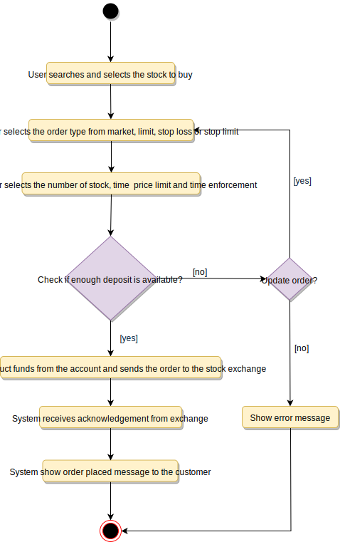

**Place a sell order:** Any system user can perform this activity. Here are the steps to place a buy order:

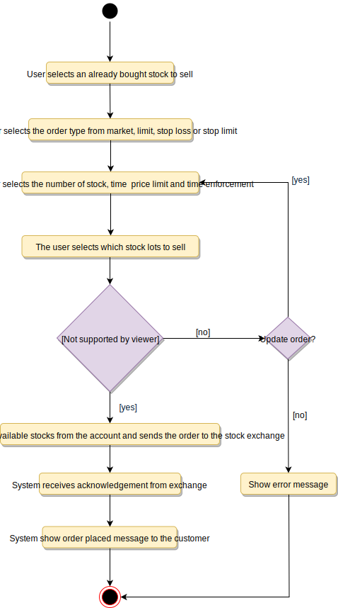

### Code

Here is the code for the top use cases.

**Enums and Constants:** Here are the required enums and constants:

```java
public enum ReturnStatus {
    SUCCESS, FAIL, INSUFFICIENT_FUNDS, INSUFFICIENT_QUANTITY, NO_STOCK_POSITION
}

public enum OrderStatus {
    OPEN, FILLED, PARTIALLY_FILLED, CANCELLED
}

public enum TimeEnforcementType {
    GOOD_TILL_CANCELLED, FILL_OR_KILL, IMMEDIATE_OR_CANCEL, ON_THE_OPEN, ON_THE_CLOSE
}

public enum AccountStatus {
    ACTIVE, CLOSED, CANCELED, BLACKLISTED, None
}

public class Location {
    private String streetAddress;
    private String city;
    private String state;
    private String zipCode;
    private String country;
}

public static class Constants {
    public static final int MONEY_TRANSFER_LIMIT = 100_000;
}
```

**StockExchange:** To encapsulate all the interactions with the stock exchange:

```java
public class StockExchange {

    private static StockExchange stockExchangeInstance = null;

    // private constructor to restrict for singleton
    private StockExchange() {
    }

    // static method to get the singleton instance of StockExchange
    public static StockExchange getInstance() {
        if (stockExchangeInstance == null) {
            stockExchangeInstance = new StockExchange();
        }
        return stockExchangeInstance;
    }

    public static boolean placeOrder(Order order) {
        boolean returnStatus = getInstance().submitOrder(Order);
        return returnStatus;
    }
}
```

**Order:** To encapsulate all buy or sell orders:

```java
public abstract class Order {
    private String orderNumber;
    public boolean isBuyOrder;
    private OrderStatus status;
    private TimeEnforcementType timeEnforcement;
    private Date creationTime;

    private HashMap<Integer, OrderPart> parts;

    public void setStatus(OrderStatus status) {
        this.status = status;
    }

    public bool saveInDB() {
// save in the database
    }

    public void addOrderParts(OrderParts parts) {
        for (OrderPart part : parts) {
            this.parts.put(part.id, part);
        }
    }
}

public class LimitOrder extends Order {
    private double priceLimit;
}
```

**Member:** Members will be buying and selling stocks:

```java
// For simplicity, we are not defining getter and setter functions. The reader can
// assume that all class attributes are private and accessed through their respective
// public getter methods and modified only through their public methods function.

public abstract class Account {
    private String id;
    private String password;
    private String name;
    private AccountStatus status;
    private Location address;
    private String email;
    private String phone;

    public boolean resetPassword();
}

public class Member extends Account {
    private double availableFundsForTrading;
    private Date dateOfMembership;

    private HashMap<string, StockPosition> stockPositions;

    private HashMap<Integer, Order> activeOrders;

    public ErrorCode placeSellLimitOrder(
            string stockId,
            float quantity,
            int limitPrice,
            TimeEnforcementType enforcementType) {
// check if member has this stock position
        if (!stockPositions.containsKey(stockId)) {
            return NO_STOCK_POSITION;
        }

        StockPosition stockPosition = stockPosition.get(stockId);
// check if the member has enough quantity available to sell
        if (stockPosition.getQuantity() < quantity) {
            return INSUFFICIENT_QUANTITY;
        }

        LimitOrder order =
                new LimitOrder(stockId, quantity, limitPrice, enforcementType);
        order.isBuyOrder = false;
        order.saveInDB();
        boolean success = StockExchange::placeOrder (order);
        if (!success) {
            order.setStatus(OrderStatus::FAILED);
            order.saveInDB();
        } else {
            activeOrders.add(orderId, order);
        }
        return success;
    }

    public ErrorCode placeBuyLimitOrder(
            string stockId,
            float quantity,
            int limitPrice,
            TimeEnforcementType enforcementType) {
// check if the member has enough funds to buy this stock
        if (availableFundsForTrading < quantity * limitPrice) {
            return INSUFFICIENT_FUNDS;
        }

        LimitOrder order =
                new LimitOrder(stockId, quantity, limitPrice, enforcementType);
        order.isBuyOrder = true;
        order.saveInDB();
        boolean success = StockExchange::placeOrder (order);
        if (!success) {
            order.setStatus(OrderStatus::FAILED);
            order.saveInDB();
        } else {
            activeOrders.add(orderId, order);
        }
        return success;
    }

    // this function will be invoked whenever there is an update from
// stock exchange against an order
    public void callbackStockExchange(int orderId, List<OrderPart> orderParts, OrderStatus status) {
        Order order = activeOrders.get(orderId);
        order.addOrderParts(orderParts);
        order.setStatus(status);
        order.updateInDB();

        if (status == OrderStatus::FILLED || status == OrderStatus::CANCELLEd) {
            activeOrders.remove(orderId);
        }
    }
}
```

# Design a Car Rental System

Let's design a car rental system where customers can rent vehicles.

A Car Rental System is a software built to handle the renting of automobiles for a short period of time, generally
ranging from a few hours to a few weeks. A car rental system often has numerous local branches (to allow its user to
return a vehicle to a different location), and primarily located near airports or busy city areas.


### System Requirements

We will focus on the following set of requirements while designing our Car Rental System:

01. The system will support the renting of different automobiles like cars, trucks, SUVs, vans, and motorcycles.
02. Each vehicle should be added with a unique barcode and other details, including a parking stall number which helps
    to locate the vehicle.
03. The system should be able to retrieve information like which member took a particular vehicle or what vehicles have
    been rented out by a specific member.
04. The system should collect a late-fee for vehicles returned after the due date.
05. Members should be able to search the vehicle inventory and reserve any available vehicle.
06. The system should be able to send notifications whenever the reservation is approaching the pick-up date, as well as
    when the vehicle is nearing the due date or has not been returned within the due date.
07. The system will be able to read barcodes from vehicles.
08. Members should be able to cancel their reservations.
09. The system should maintain a vehicle log to track all events related to the vehicles.
10. Members can add rental insurance to their reservation.
11. Members can rent additional equipment, like navigation, child seat, ski rack, etc.
12. Members can add additional services to their reservation, such as roadside assistance, additional driver, wifi, etc.

### Use case diagram

We have four main Actors in our system:

- **Receptionist:** Mainly responsible for adding and modifying vehicles and workers. Receptionists can also reserve
  vehicles.
- **Member:** All members can search the catalog, as well as reserve, pick-up, and return a vehicle.
- **System:** Mainly responsible for sending notifications about overdue vehicles, canceled reservation, etc.
- **Worker:** Mainly responsible for taking care of a returned vehicle and updating the vehicle log.

Here are the top use cases of the Car Rental System:

- **Add/Remove/Edit vehicle:** To add, remove or modify a vehicle.
- **Search catalog:** To search for vehicles by type and availability.
- **Register new account/Cancel membership:** To add a new member or cancel an existing membership.
- **Reserve vehicle:** To reserve a vehicle.
- **Check-out vehicle:** To rent a vehicle.
- **Return a vehicle:** To return a vehicle which was checked-out to a member.
- **Add equipment:** To add an equipment to a reservation like navigation, child seat, etc.
- **Update car log:** To add or update a car log entry, such as refueling, cleaning, damage, etc.


Use case diagram

### Class diagram

Here are the main classes of our Car Rental System:

- **CarRentalSystem:** The main part of the organization for which this software has been designed.
- **CarRentalLocation:** The car rental system will have multiple locations, each location will have attributes like
  ‘Name’ to distinguish it from any other locations and ‘Address’ which defines the address of the rental location.
- **Vehicle:** The basic building block of the system. Every vehicle will have a barcode, license plate number,
  passenger capacity, model, make, mileage, etc. Vehicles can be of multiple types, like car, truck, SUV, etc.
- **Account:** Mainly, we will have two types of accounts in the system, one will be a general member and the other will
  be a receptionist. Another account can be of the worker taking care of the returned vehicle.
- **VehicleReservation:** This class will be responsible for managing reservations for a vehicle.
- **Notification:** Will take care of sending notifications to members.
- **VehicleLog:** To keep track of all the events related to a vehicle.
- **RentalInsurance:** Stores details about the various rental insurances that members can add to their reservation.
- **Equipment:** Stores details about the various types of equipment that members can add to their reservation.
- **Service:** Stores details about the various types of service that members can add to their reservation, such as
  additional drivers, roadside assistance, etc.
- **Bill:** Contains different bill-items for every charge for the reservation.

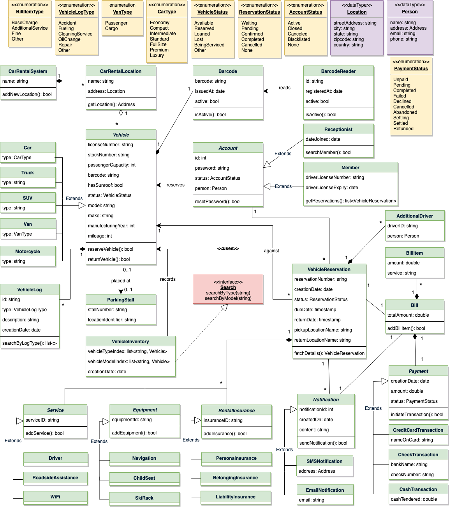

Class diagram


### Activity diagrams

**Pick up a vehicle:** Any member can perform this activity. Here are the steps to pick up a vehicle:

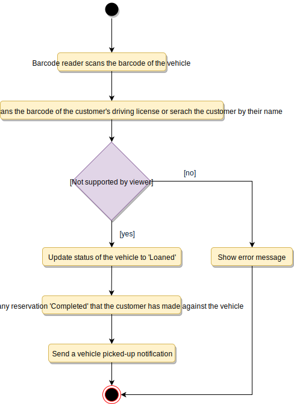

**Return a vehicle:** Any worker can perform this activity. While returning a vehicle, the system must collect a late
fee from the member if the return date is after the due date. Here are the steps for returning a vehicle:

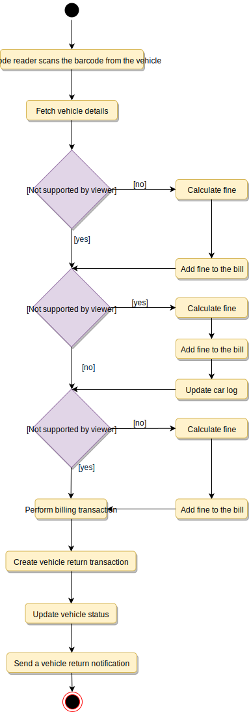

### Code

Here is the high-level definition for the classes described above.

**Enums, data types and constants:** Here are the required enums, data types, and constants:

```java
public enum BillItemType {
    BASE_CHARGE, ADDITIONAL_SERVICE, FINE, OTHER
}

public enum VehicleLogType {
    ACCIDENT, FUELING, CLEANING_SERVICE, OIL_CHANGE, REPAIR, OTHER
}

public enum VanType {
    PASSENGER, CARGO
}

public enum CarType {
    ECONOMY, COMPACT, INTERMEDIATE, STANDARD, FULL_SIZE, PREMIUM, LUXURY
}

public enum VehicleStatus {
    AVAILABLE, RESERVED, LOANED, LOST, BEING_SERVICED, OTHER
}

public enum ReservationStatus {
    ACTIVE, PENDING, CONFIRMED, COMPLETED, CANCELLED, NONE
}

public enum AccountStatus {
    ACTIVE, CLOSED, CANCELED, BLACKLISTED, BLOCKED
}

public enum PaymentStatus {
    UNPAID, PENDING, COMPLETED, FILLED, DECLINED, CANCELLED, ABANDONED, SETTLING, SETTLED, REFUNDED
}

public class Address {
    private String streetAddress;
    private String city;
    private String state;
    private String zipCode;
    private String country;
}

public class Person {
    private String name;
    private Address address;
    private String email;
    private String phone;
}
```

**Account, Member, Receptionist, and Additional Driver:** These classes represent different people that interact with
our system:

```java
// For simplicity, we are not defining getter and setter functions. The reader can
// assume that all class attributes are private and accessed through their respective
// public getter method and modified only through their public setter method.

public abstract class Account {
    private String id;
    private String password;
    private AccountStatus status;
    private Person person;

    public boolean resetPassword();
}

public class Member extends Account {
    private int totalVehiclesReserved;

    public List<VehicleReservation> getReservations();
}

public class Receptionist extends Account {
    private Date dateJoined;

    public List<Member> searchMember(String name);
}

public class AdditionalDriver {
    private String driverID;
    private Person person;
}
```

**CarRentalSystem and CarRentalLocation:** These classes represent the top level classes:

```java
public class CarRentalLocation {
    private String name;
    private Address location;

    public Address getLocation();
}

public class CarRentalSystem {
    private String name;
    private List<CarRentalLocation> locations;

    public boolean addNewLocation(CarRentalLocation location);
}
```

**Vehicle, VehicleLog, and VehicleReservation:** To encapsulate a vehicle, log, and reservation. The VehicleReservation
class will be responsible for processing the reservation and return of a vehicle:

```java
public abstract class Vehicle {
    private String licenseNumber;
    private String stockNumber;
    private int passengerCapacity;
    private String barcode;
    private boolean hasSunroof;
    private VehicleStatus status;
    private String model;
    private String make;
    private int manufacturingYear;
    private int mileage;

    private List<VehicleLog> log;

    public boolean reserveVehicle();

    public boolean returnVehicle();
}

public class Car extends Vehicle {
    private CarType type;
}

public class Van extends Vehicle {
    private VanType type;
}

public class Truck extends Vehicle {
    private String type;
}

// We can have similar definition for other vehicle types

//...

public class VehicleLog {
    private String id;
    private VehicleLogType type;
    private String description;
    private Date creationDate;

    public bool update();

    public List<VehicleLogType> searchByLogType(VehicleLogType type);
}

public class VehicleReservation {
    private String reservationNumber;
    private Date creationDate;
    private ReservationStatus status;
    private Date dueDate;
    private Date returnDate;
    private String pickupLocationName;
    private String returnLocationName;

    private int customerID;
    private Vehicle vehicle;
    private Bill bill;
    private List<AdditionalDriver> additionalDrivers;
    private List<Notification> notifications;
    private List<RentalInsurance> insurances;
    private List<Equipment> equipments;
    private List<Service> services;

    public static VehicleReservation fetchReservationDetails(String reservationNumber);

    public List<Passenger> getAdditionalDrivers();
}
```

**VehicleInventory and Search:** VehicleInventory will implement an interface ‘Search’ to facilitate the searching of
vehicles:

```java
public interface Search {
    public List<Vehicle> searchByType(String type);

    public List<Vehicle> searchByModel(String model);
}

public class VehicleInventory implements Search {
    private HashMap<String, List<Vehicle>> vehicleTypes;
    private HashMap<String, List<Vehicle>> vehicleModels;

    public List<Vehicle> searchByType(String query) {
// return all vehicles of the given type.
        return vehicleTypes.get(query);
    }

    public List<Vehicle> searchByModel(String query) {
// return all vehicles of the given model.
        return vehicleModels.get(query);
    }
}
```

# Design LinkedIn

Let's design LinkedIn.

LinkedIn is a social network for professionals. The main goal of the site is to enable its members to connect with
people they know and trust professionally, as well as to find new opportunities to grow their careers.

A LinkedIn member’s profile page, which emphasizes their skills, employment history, and education, has professional
network news feeds with customizable modules.

LinkedIn is very similar to Facebook in terms of its layout and design. These features are more specialized because they
cater to professionals, but in general, if you know how to use Facebook or any other similar social network, LinkedIn is
somewhat comparable.


### System Requirements

We will focus on the following set of requirements while designing LinkedIn:

01. Each member should be able to add information about their basic profile, experiences, education, skills, and
    accomplishments.
02. Any user of our system should be able to search for other members or companies by their name.
03. Members should be able to send or accept connection requests from other members.
04. Any member will be able to request a recommendation from other members.
05. The system should be able to show basic stats about a profile, like the number of profile views, the total number of
    connections, and the total number of search appearances of the profile.
06. Members should be able to create new posts to share with their connections.
07. Members should be able to add comments to posts, as well as like or share a post or comment.
08. Any member should be able to send messages to other members.
09. The system should send a notification to a member whenever there is a new message, connection invitation or a
    comment on their post.
10. Members will be able to create a page for a Company and add job postings.
11. Members should be able to create groups and join any group they like.
12. Members should be able to follow other members or companies.

### Use case diagram

We have three main Actors in our system:

- **Member:** All members can search for other members, companies or jobs, as well as send requests for connection,
  create posts, etc.
- **Admin:** Mainly responsible for admin functions such as blocking and unblocking a member, etc.
- **System:** Mainly responsible for sending notifications for new messages, connections invites, etc.

Here are the top use cases of our system:

- **Add/update profile:** Any member should be able to create their profile to reflect their experiences, education,
  skills, and accomplishments.
- **Search:** Members can search other members, companies or jobs. Members can send a connection request to other
  members.
- **Follow or Unfollow member or company:** Any member can follow or unfollow any other member or a company.
- **Send message:** Any member can send a message to any of their connections.
- **Create post:** Any member can create a post to share with their connections, as well as like other posts or add
  comments to any post.
- **Send notifications:** The system will be able to send notifications for new messages, connection invites, etc.

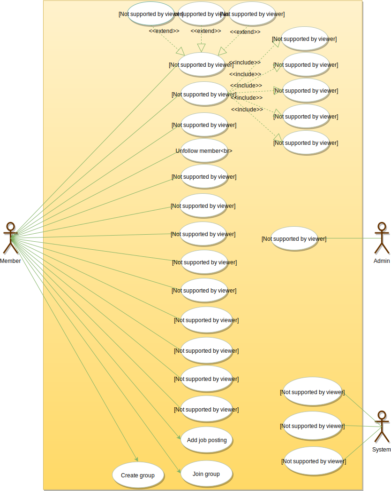

Use case diagram

### Class diagram

Here are the main classes of the LinkedIn system:

- **Member:** This will be the main component of our system. Each member will have a profile which includes their
  Experiences, Education, Skills, Accomplishments, and Recommendations. Members will be connected to other members and
  they can follow companies and members. Members will also have suggestions to make connections with other members.
- **Search:** Our system will support searching for other members and companies by their names, and jobs by their
  titles.
- **Message:** Members can send messages to other members with text and media.
- **Post:** Members can create posts containing text and media.
- **Comment:** Members can add comments to posts as well as like them.
- **Group:** Members can create and join groups.
- **Company:** Company will store all the information about a company’s page.
- **JobPosting:** Companies can create a job posting. This class will handle all information about a job.
- **Notification:** Will take care of sending notifications to members.


Class diagram


### Activity diagrams

**Add experience to profile:** Any LinkedIn member can perform this activity. Here are the steps to add experience to a
member profile:

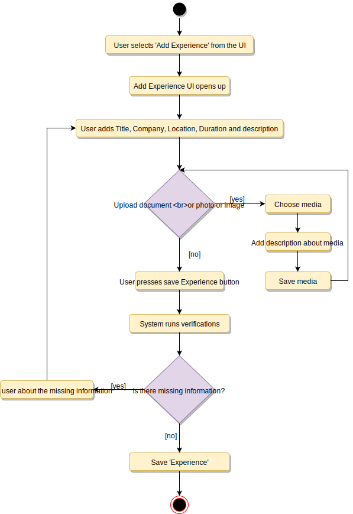

**Send message:** Any Member can perform this activity. After sending a message, the system needs to send a notification
to all the requested members. Here are the steps for sending a message:

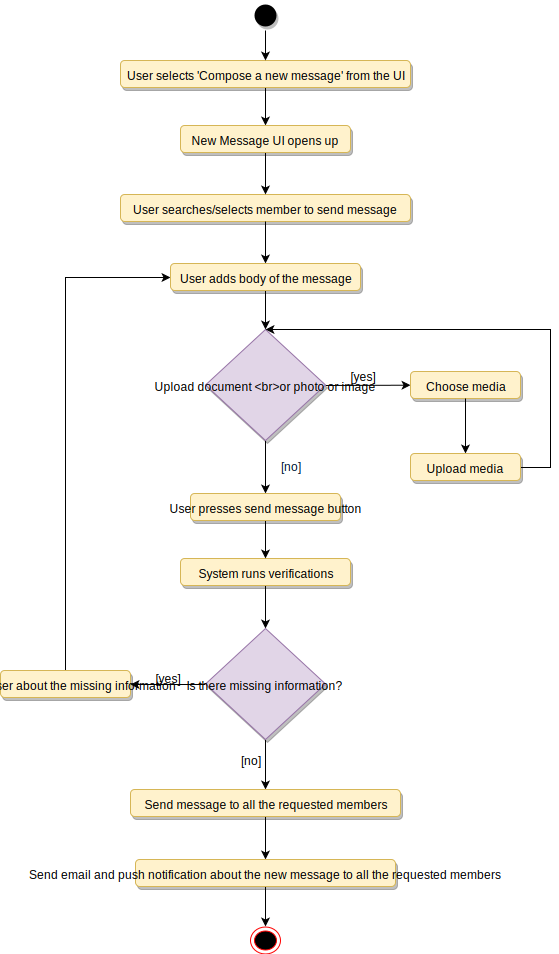

### Code

Here is the high-level definition for the classes described above:

**Enums, data types, and constants:** Here are the required enums, data types, and constants:

```java
public enum ConnectionInvitationStatus {
    PENDING, ACCEPTED, CONFIRMED, REJECTED, CANCELED
}

public enum AccountStatus {
    ACTIVE, BLOCKED, BANNED, COMPROMISED, ARCHIVED, UNKNOWN
}

public class Address {
    private String streetAddress;
    private String city;
    private String state;
    private String zipCode;
    private String country;
}
```

**Account, Person, Member, and Admin:** These classes represent the different people that interact with our system:

```java
// For simplicity, we are not defining getter and setter functions. The reader can
// assume that all class attributes are private and accessed through their respective
// public getter method and modified only through their public setter method.

public class Account {
    private String id;
    private String password;
    private AccountStatus status;

    public boolean resetPassword();
}

public abstract class Person {
    private String name;
    private Address address;
    private String email;
    private String phone;

    private Account account;
}

public class Member extends Person {
    private Date dateOfMembership;
    private String headline;
    private byte[] photo;
    private List<Member> memberSuggestions;
    private List<Member> memberFollows;
    private List<Member> memberConnections;
    private List<Company> companyFollows;
    private List<Group> groupFollows;
    private Profile profile;

    public boolean sendMessage(Message message);

    public boolean createPost(Post post);

    public boolean sendConnectionInvitation(ConnectionInvitation invitation);
}

public class Admin extends Person {
    public boolean blockUser(Customer customer);

    public boolean unblockUser(Customer customer);
}
```

**Profile, Experience, etc:** A member’s profile will have their job experiences, educations, skills, etc:

```java
public class Profile {
    private String summary;
    private List<Experience> experiences;
    private List<Education> educations;
    private List<Skill> skills;
    private List<Accomplishment> accomplishments;
    private List<Recommendation> recommendations;
    private List<Stat> stats;

    public boolean addExperience(Experience experience);

    public boolean addEducation(Education education);

    public boolean addSkill(Skill skill);

    public boolean addAccomplishment(Accomplishment accomplishment);

    public boolean addRecommendation(Recommendation recommendation);
}

public class Experience {
    private String title;
    private String company;
    private String location;
    private Date from;
    private Date to;
    private String description;
}
```

**Company and JobPosting:** Companies can have multiple job postings:

```java
public class Company {
    private String name;
    private String description;
    private String type;
    private int companySize;

    private List<JobPosting> activeJobPostings;
}

public class JobPosting {
    private Date dateOfPosting;
    private String description;
    private String employmentType;
    private String location;
    private boolean isFulfilled;
}
```

**Group, Post, and Message:** Members can create posts, send messages, and join groups:

```java
public class Group {
    private String name;
    private String description;
    private int totalMembers;
    private List<Member> members;

    public boolean addMember(Member member);

    public boolean updateDescription(String description);
}

public class Post {
    private String text;
    private int totalLikes;
    private int totalShares;
    private Member owner;
}

public class Message {
    private Member[] sentTo;
    private String messageBody;
    private byte[] media;
}
```

**Search interface and SearchIndex:** SearchIndex will implement the Search interface to facilitate searching for
members, companies and job postings:

```java
public interface Search {
    public List<Member> searchMember(String name);

    public List<Company> searchCompany(String name);

    public List<JobPosting> searchJob(String title);
}

public class SearchIndex implements Search {
    HashMap<String, List<Member>> memberNames;
    HashMap<String, List<Company>> companyNames;
    HashMap<String, List<JobPosting>> jobTitles;

    public boolean addMember(Member member) {
        if (memberNames.containsKey(member.getName())) {
            memberNames.get(member.getName()).add(member);
        } else {
            memberNames.put(member.getName(), member);
        }
    }

    public boolean addCompany(Company company);

    public boolean addJobPosting(JobPosting jobPosting);

    public List<Member> searchMember(String name) {
        return memberNames.get(name);
    }

    public List<Company> searchCompany(String name) {
        return companyNames.get(name);
    }

    public List<JobPosting> searchJob(String title) {
        return jobTitles.get(title);
    }
}
```

# Design Cricinfo

Let's design Cricinfo.

Cricinfo is a sports news website exclusively for the game of cricket. The site features live coverage of cricket
matches containing ball-by-ball commentary and a database for all the historic matches. The site also provides news and
articles about cricket.


### System Requirements

We will focus on the following set of requirements while designing Cricinfo:

1. The system should keep track of all cricket-playing teams and their matches.
2. The system should show live ball-by-ball commentary of cricket matches.
3. All international cricket rules should be followed.
4. Any team playing a tournament will announce a squad (a set of players) for the tournament.
5. For each match, both teams will announce their playing-eleven from the tournament squad.
6. The system should be able to record stats about players, matches, and tournaments.
7. The system should be able to answer global stats queries like, “Who is the highest wicket taker of all time?”, “Who
   has scored maximum numbers of 100s in test matches?”, etc.
8. The system should keep track of all ODI, Test and T20 matches.

### Use case diagram

We have two main Actors in our system:

- **Admin:** An Admin will be able to add/modify players, teams, tournaments, and matches, and will also record
  ball-by-ball details of each match.
- **Commentator:** Commentators will be responsible for adding ball-by-ball commentary for matches.

Here are the top use cases of our system:

- **Add/modify teams and players:** An Admin will add players to teams and keeps up-to-date information about them in
  the system.
- **Add tournaments and matches:** Admins will add tournaments and matches in the system.
- **Add ball:** Admins will record ball-by-ball details of a match.
- **Add stadium, umpire, and referee:** The system will keep track of stadiums as well as of the umpires and referees
  managing the matches.
- **Add/update stats:** Admins will add stats about matches and tournaments. The system will generate certain stats.
- **Add commentary:** Add ball-by-ball commentary of matches.

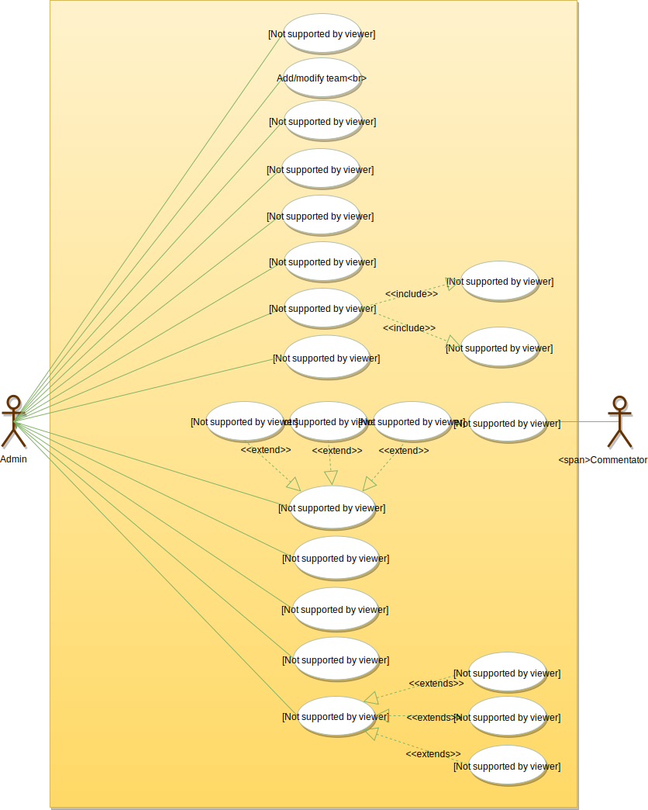

Use case diagram

### Class diagram

Here are the main classes of the Cricinfo system:

- **Player:** Keeps a record of a cricket player, their basic profile and contracts.
- **Team:** This class manages cricket teams.
- **Tournament:** Manages cricket tournaments and keeps track of the points table for all playing teams.
- **TournamentSquad:** Each team playing a tournament will announce a set of players who will be playing the tournament.
  TournamentSquad will encapsulate that.
- **Playing11:** Each team playing a match will select 11 players from their announced tournaments squad.
- **Match:** Encapsulates all information of a cricket match. Our system will support three match types: 1) ODI, 2) T20,
  and 3) Test
- **Innings:** Records all innings of a match.
- **Over:** Records details about an Over.
- **Ball:** Records every detail of a ball, such as the number of runs scored, if it was a wicket-taking ball, etc.
- **Run:** Records the number and type of runs scored on a ball. The different run types are: Wide, LegBy, Four, Six,
  etc.
- **Commentator and Commentary:** The commentator adds ball-by-ball commentary.
- **Umpire and Referee:** These classes will store details about umpires and referees, respectively.
- **Stat:** Our system will keep track of the stats for every player, match and tournament.
- **StatQuery:** This class will encapsulate general stat queries and their answers, like “Who has scored the maximum
  number of 100s in ODIs?” or, “Which bowler has taken the most wickets in test matches?”, etc.

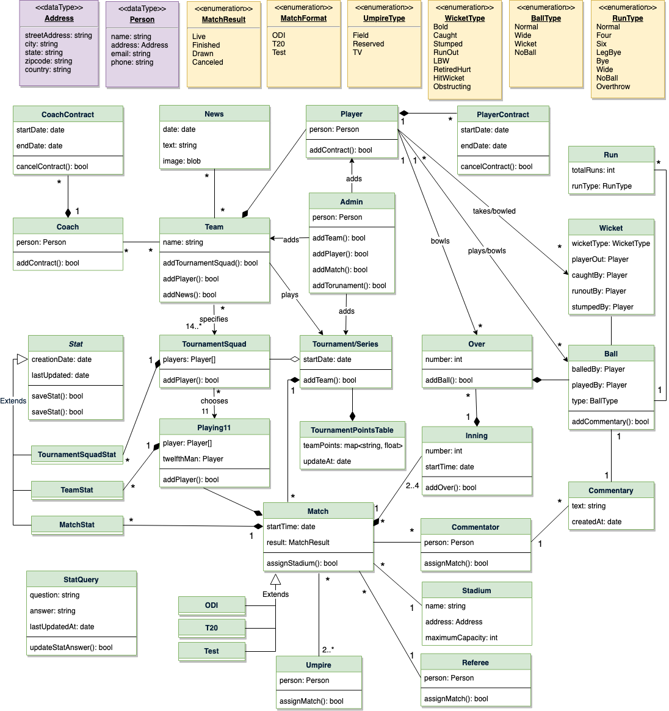

Class diagram


### Activity diagrams

**Record a Ball of an Over:** Here are the steps to record a ball of an over in the system:

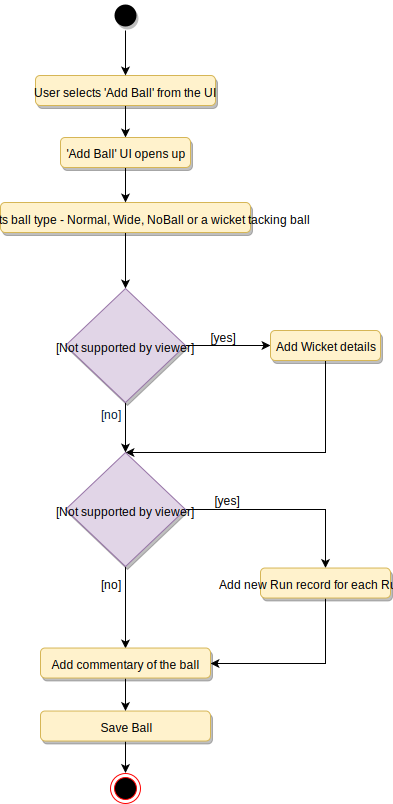

### Code

Here is the high-level definition for the classes described above.

**Enums, data types, and constants:** Here are the required enums, data types, and constants:

```java
public class Address {
    private String streetAddress;
    private String city;
    private String state;
    private String zipCode;
    private String country;
}

public class Person {
    private String name;
    private Address address;
    private String email;
    private String phone;
}

public enum MatchFormat {
    ODI,
    T20,
    TEST
}

public enum MatchResult {
    LIVE,
    FINISHED,
    DRAWN,
    CANCELED
}

public enum UmpireType {
    FIELD,
    RESERVED,
    TV
}

public enum WicketType {
    BOLD,
    CAUGHT,
    STUMPED,
    RUN_OUT,
    LBW,
    RETIRED_HURT,
    HIT_WICKET,
    OBSTRUCTING
}

public enum BallType {
    NORMAL,
    WIDE,
    WICKET,
    NO_BALL
}

public enum RunType {
    NORMAL,
    FOUR,
    SIX,
    LEG_BYE,
    BYE,
    NO_BALL,
    OVERTHROW
}
```

**Admin, Player, Umpire, Referee, and Commentator:** These classes represent the different people that interact with our
system:

```java
// For simplicity, we are not defining getter and setter functions. The reader can
// assume that all class attributes are private and accessed through their respective
// public getter method and modified only through their public setter method.

public class Player {
    private Person person;
    private ArrayList<PlayerContract> contracts;

    public boolean addContract();
}

public class Admin {
    private Person person;

    public boolean addMatch(Match match);

    public boolean addTeam(Team team);

    public boolean addTournament(Tournament tournament);
}

public class Umpire {
    private Person person;

    public boolean assignMatch(Match match);
}

public class Referee {
    private Person person;

    public boolean assignMatch(Match match);
}

public class Commentator {
    private Person person;

    public boolean assignMatch(Match match);
}
```

**Team, TournamentSquad, and Playing11:** Team will announce a squad for a tournament, out of which, the playing 11 will
be chosen:

```java
public class Team {
    private String name;
    private List<Player> players;
    private List<News> news;
    private Coach coach;

    public boolean addTournamentSquad(TournamentSquad tournamentSquad);

    public boolean addPlayer(Player player);

    public boolean addNews(News news);
}

public class TournamentSquad {
    private List<Player> players;
    private List<TournamentStat> tournamentStats;

    public boolean addPlayer(Player player);
}

public class Playing11 {
    private List<Player> players;
    private Player twelfthMan;

    public boolean addPlayer(Player player);
}
```

**Over, Ball, Wicket, Commentary, Inning, and Match:** Match will be an abstract class, extended by ODI, Test, and T20:

```java
public class Over {
    private int number;
    private List<Ball> balls;

    public boolean addBall(Ball ball);
}

public class Ball {
    private Player balledBy;
    private Player playedBy;
    private BallType type;

    private Wicket wicket;
    private List<Run> runs;
    private Commentary commentary;

}

public class Wicket {
    private WicketType wicketType;
    private Player playerOut;
    private Player caughtBy;
    private Player runoutBy;
    private Player stumpedBy;
}

public class Commentary {
    private String text;
    private Date createdAt;
    private Commentator createdBy;
}

public class Inning {
    private int number;
    private Date startTime;
    private List<Over> overs;

    public boolean addOver(Over over);
}

public abstract class Match {
    private int number;
    private Date startTime;
    private MatchResult result;

    private Playing11[] teams;
    private List<Inning> innings;
    private List<Umpire> umpires;
    private Referee referee;
    private List<Commentator> commentators;
    private List<MatchStat> matchStats;

    public boolean assignStadium(Stadium stadium);

    public boolean assignReferee(Referee referee);
}

public class ODI extends Match {
//...
}

public class Test extends Match {
//...
}
```

# Design Facebook - a social network

Facebook is an online social networking service where users can connect with other users to post and read messages.
Users access Facebook through their website interface or mobile apps.


### System Requirements

We will focus on the following set of requirements while designing Facebook:

01. Each member should be able to add information about their basic profile, work experience, education, etc.
02. Any user of our system should be able to search other members, groups or pages by their name.
03. Members should be able to send and accept/reject friend requests from other members.
04. Members should be able to follow other members without becoming their friend.
05. Members should be able to create groups and pages, as well as join already created groups, and follow pages.
06. Members should be able to create new posts to share with their friends.
07. Members should be able to add comments to posts, as well as like or share a post or comment.
08. Members should be able to create privacy lists containing their friends. Members can link any post with a privacy
    list to make the post visible only to the members of that list.
09. Any member should be able to send messages to other members.
10. Any member should be able to add a recommendation for any page.
11. The system should send a notification to a member whenever there is a new message or friend request or comment on
    their post.
12. Members should be able to search through posts for a word.

**Extended Requirement:** Write a function to find a connection suggestion for a member.

### Use case diagram

We have three main Actors in our system:

- **Member:** All members can search for other members, groups, pages, or posts, as well as send friend requests, create
  posts, etc.
- **Admin:** Mainly responsible for admin functions like blocking and unblocking a member, etc.
- **System:** Mainly responsible for sending notifications for new messages, friend requests, etc.

Here are the top use cases of our system:

- **Add/update profile:** Any member should be able to create their profile to reflect their work experiences,
  education, etc.
- **Search:** Members can search for other members, groups or pages. Members can send a friend request to other members.
- **Follow or Unfollow a member or a page:** Any member can follow or unfollow any other member or page.
- **Send message** Any member can send a message to any of their friends.
- **Create post** Any member can create a post to share with their friends, as well as like or add comments to any post
  visible to them.
- **Send notification** The system will be able to send notifications for new messages, friend requests, etc.

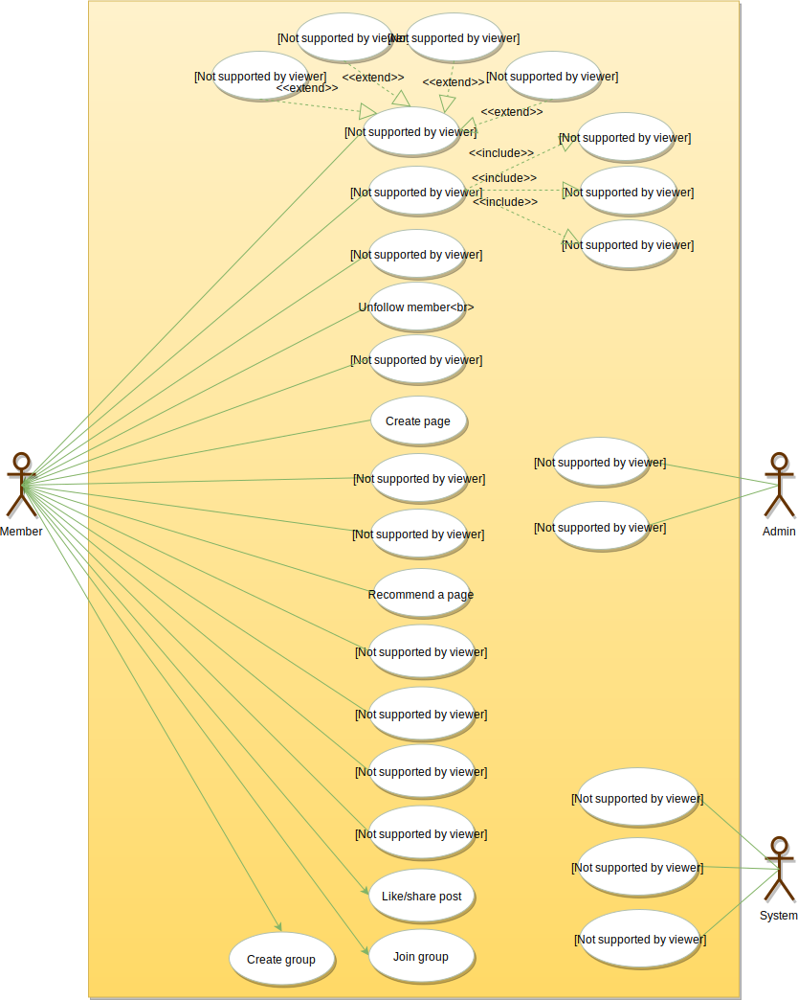

### Class diagram

Here are the main classes of the Facebook system:

- **Member:** This will be the main component of our system. Each member will have a profile which includes their Work
  Experiences, Education, etc. Members will be connected to other members and they can follow other members and pages.
  Members will also have suggestions to send friend requests to other members.
- **Search:** Our system will support searching for other members, groups and pages by their names, and through posts
  for any word.
- **Message:** Members can send messages to other members with text, photos, and videos.
- **Post:** Members can create posts containing text and media, as well as like and share a post.
- **Comment:** Members can add comments to posts as well as like any comment.
- **Group:** Members can create and join groups.
- **PrivacyList:** Members can create privacy lists containing their friends. Members can link any post with a privacy
  list, to make the post visible only to the members of that list.
- **Page:** Members can create pages that other members can follow, and share messages there.
- **Notification:** This class will take care of sending notifications to members. The system will be able to send a
  push notification or an email.

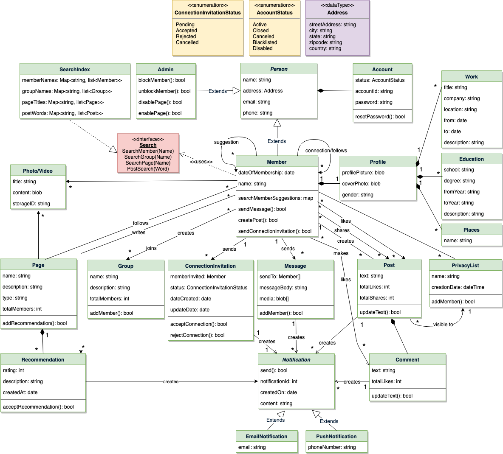

Class diagram


### Activity diagrams

**Add work experience to profile:** Any Facebook member can perform this activity. Here are the steps to add work
experience to a member’s profile:

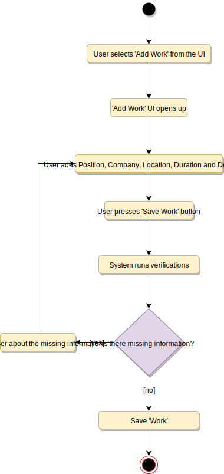

**Create a new post:** Any Member can perform this activity. Here are the steps for creating a post:

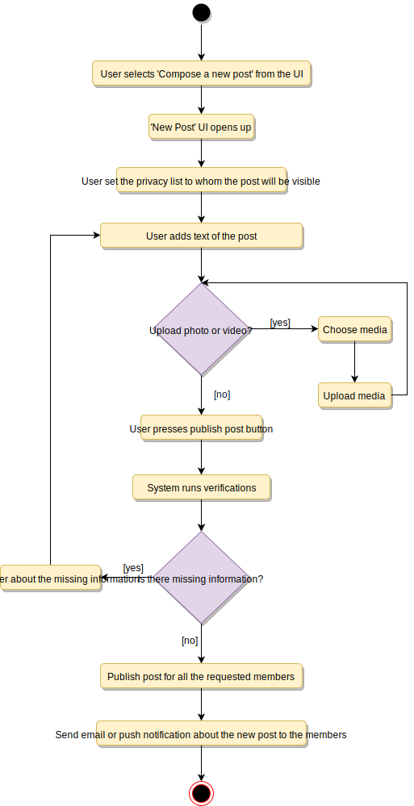

### Code

Here is the high-level definition for the classes described above.

**Enums, data types, and constants:** Here are the required enums, data types, and constants:

```java
public enum ConnectionInvitationStatus {
    PENDING,
    ACCEPTED,
    REJECTED,
    CANCELED
}

public enum AccountStatus {
    ACTIVE,
    CLOSED,
    CANCELED,
    BLACKLISTED,
    DISABLED
}

public class Address {
    private String streetAddress;
    private String city;
    private String state;
    private String zipCode;
    private String country;
}
```

**Account, Person, Member, and Admin:** These classes represent the different people that interact with our system:

```java
// For simplicity, we are not defining getter and setter functions. The reader can
// assume that all class attributes are private and accessed through their respective
// public getter method and modified only through their public setter method.

public class Account {
    private String id;
    private String password;
    private AccountStatus status;

    public boolean resetPassword();
}

public abstract class Person {
    private String name;
    private Address address;
    private String email;
    private String phone;

    private Account account;
}

public class Member extends Person {
    private Integer memberId;
    private Date dateOfMembership;
    private String name;

    private Profile profile;
    private HashSet<Integer> memberFollows;
    private HashSet<Integer> memberConnections;
    private HashSet<Integer> pageFollows;
    private HashSet<Integer> memberSuggestions;
    private HashSet<ConnectionInvitation> connectionInvitations;
    private HashSet<Integer> groupFollows;

    public boolean sendMessage(Message message);

    public boolean createPost(Post post);

    public boolean sendConnectionInvitation(ConnectionInvitation invitation);

    private Map<Integer, Integer> searchMemberSuggestions();
}

public class Admin extends Person {
    public boolean blockUser(Customer customer);

    public boolean unblockUser(Customer customer);

    public boolean enablePage(Page page);

    public boolean disablePage(Page page);
}

public class ConnectionInvitation {
    private Member memberInvited;
    private ConnectionInvitationStatus status;
    private Date dateCreated;
    private Date dateUpdated;

    public bool acceptConnection();

    public bool rejectConnection();
}
```

**Profile and Work:** A member’s profile will have their work experiences, educations, places, etc:

```java
public class Profile {
    private byte[] profilePicture;
    private byte[] coverPhoto;
    private String gender;

    private List<Work> workExperiences;
    private List<Education> educations;
    private List<Place> places;
    private List<Stat> stats;

    public boolean addWorkExperience(Work work);

    public boolean addEducation(Education education);

    public boolean addPlace(Place place);
}

public class Work {
    private String title;
    private String company;
    private String location;
    private Date from;
    private Date to;
    private String description;
}
```

**Page and Recommendation:** Each page can have multiple recommendations, and members will follow/like pages:

```java
public class Page {
    private Integer pageId;
    private String name;
    private String description;
    private String type;
    private int totalMembers;
    private List<Recommendation> recommendation;

    private List<Recommendation> getRecommendation();
}

public class Recommendation {
    private Integer recommendationId;
    private int rating;
    private String description;
    private Date createdAt;
}
```

**Group, Post, Message, and Comment:** Members can create posts, comment on posts, send messages and join groups:

```java
public class Group {
    private Integer groupId;
    private String name;
    private String description;
    private int totalMembers;
    private List<Member> members;

    public boolean addMember(Member member);

    public boolean updateDescription(String description);
}

public class Post {
    private Integer postId;
    private String text;
    private int totalLikes;
    private int totalShares;
    private Member owner;
}

public class Message {
    private Integer messageId;
    private Member[] sentTo;
    private String messageBody;
    private byte[] media;

    public boolean addMember(Member member);
}

public class Comment {
    private Integer commentId;
    private String text;
    private int totalLikes;
    private Member owner;
}
```

**Search interface and SearchIndex:** SearchIndex will implement Search to facilitate searching of members, groups,
pages, and posts:

```java
public interface Search {
    public List<Member> searchMember(String name);

    public List<Group> searchGroup(String name);

    public List<Page> searchPage(String name);

    public List<Post> searchPost(String word);
}

public class SearchIndex implements Search {
    HashMap<String, List<Member>> memberNames;
    HashMap<String, List<Group>> groupNames;
    HashMap<String, List<Page>> pageTitles;
    HashMap<String, List<Post>> posts;

    public boolean addMember(Member member) {
        if (memberNames.containsKey(member.getName())) {
            memberNames.get(member.getName()).add(member);
        } else {
            memberNames.put(member.getName(), member);
        }
    }

    public boolean addGroup(Group group);

    public boolean addPage(Page page);

    public boolean addPost(Post post);

    public List<Member> searchMember(String name) {
        return memberNames.get(name);
    }

    public List<Group> searchGroup(String name) {
        return groupNames.get(name);
    }

    public List<Page> searchPage(String name) {
        return pageTitles.get(name);
    }

    public List<Post> searchPost(String word) {
        return posts.get(word);
    }
}
```

### Extended requirement

Here is the code for finding connection suggestions for a member.

There can be many strategies to search for connection suggestions; we will do a two-level deep breadth-first search to
find people who have the most connections with each other. These people could be good candidates for a connection
suggestion, here is the sample Java code:

```java
import java.util.HashSet;
import java.util.LinkedHashMap;
import java.util.Map;
import java.util.stream.Collectors;

import static java.util.Collections.reverseOrder;

public class Member extends Person {
    private Integer memberId;
    private Date dateOfMembership;
    private String name;

    private Profile profile;
    private HashSet<Integer> memberFollows;
    private HashSet<Integer> memberConnections;
    private HashSet<Integer> pageFollows;
    private HashSet<Integer> memberSuggestions;
    private HashSet<ConnectionInvitation> connectionInvitations;
    private HashSet<Integer> groupFollows;

    public boolean sendMessage(Message message);

    public boolean createPost(Post post);

    public boolean sendConnectionInvitation(ConnectionInvitation invitation);

    private Map<Integer, Integer> searchMemberSuggestions() {
        Map<Integer, Integer> suggestions = new HashMap<>();
        for (Integer memberId : this.memberConnections) {
            HashSet<Integer> firstLevelConnections = new Member(memberId).getMemberConnections();
            for (Integer firstLevelConnectionId : firstLevelConnections) {
                this.findMemberSuggestion(suggestions, firstLevelConnectionId);
                HashSet<Integer> secondLevelConnections = new Member(firstLevelConnectionId).getMemberConnections();
                for (Integer secondLevelConnectionId : secondLevelConnections) {
                    this.findMemberSuggestion(suggestions, secondLevelConnectionId);
                }
            }
        }

// sort by value (increasing count), i.e., by highest number of mutual connection count
        Map<Integer, Integer> result = new LinkedHashMap<>();
        suggestions.entrySet().stream()
                .sorted(reverseOrder(Map.Entry.comparingByValue()))
                .forEachOrdered(x -> result.put(x.getKey(), x.getValue()));

        return result;
    }

    private void findMemberSuggestion(Map<Integer, Integer> suggestions, Integer connectionId) {
// return if the proposed suggestion is already a connection or if there is a
// pending connection invitation
        if (this.memberConnections.contains(connectionId) ||
                this.connectionInvitations.contains(connectionId)) {
            return;
        }

        int count = suggestions.containsKey(connectionId) ? suggestions.get(connectionId) : 0;
        suggestions.put(connectionId, count + 1);
    }
}
```
